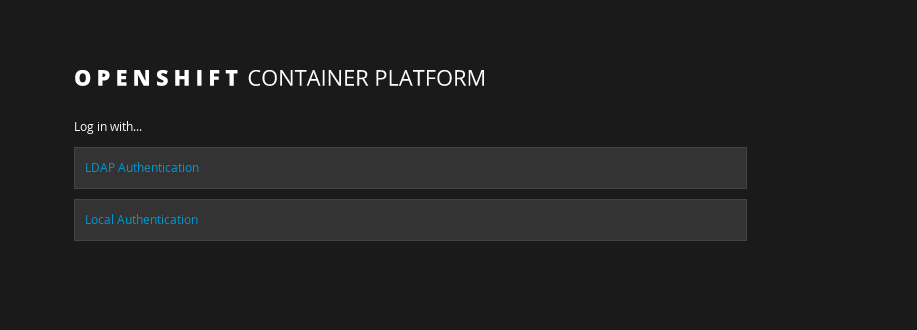
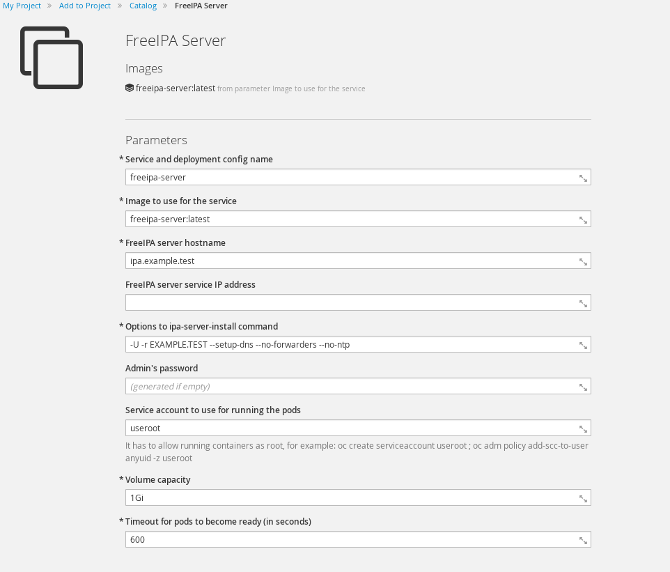

# Adding an LDAP Provider

In this lab you will learn how to use an LDAP server as an authentication provider in OpenShift. 

**NOTE:** If you do not have access to an LDAP server you can look at [Apendix A.](#apendix-a---ipa-on-openshift) This shows you how to deploy an LDAP server inside of OpenShift for testing.

## Step 1

OpenShift takes a "hands off" approach to user authentication. That is, it "offloads" the authentication part to an "external" provider.

Take a note of the users
```
oc get users
NAME      UID                                    FULL NAME   IDENTITIES
demo      72455092-6dad-11e7-b505-5254005e6599               Local Authentication:demo
```

You will note in the `IDENTITIES` field that it lists where the user `demo` is being authenticated to. You can look at this config on the master config file.

```
root@master# grep -A4 "Local Authentication" /etc/origin/master/master-config.yaml
    name: "Local Authentication"
    provider:
      apiVersion: v1
      file: /etc/origin/openshift-passwd
      kind: HTPasswdPasswordIdentityProvider
```

Here OpenShift is "offloading" the auth with a flat htpasswd file.

```
cat /etc/origin/openshift-passwd 
demo:$apr1$tuMj6pjc$uHo8IoNUoK0mGx6omnI1l1
```

It is useful to keep this as an authentication method in case your LDAP server goes down. So we will be adding (not replacing) authentcation backends. This will show how you can "stack" your authentication methods.

First, make a backup copy of the config file so we can come back to it.

```
cp -a /etc/origin/master/master-config.yaml /etc/origin/master/master-config.yaml.bk
```

## Step 2

You will need to get a "bind" password and account from LDAP provider.

If you deployed the Apendix A LDAP server, get your password like so

```
oc rsh freeipa-server-1-dp1sv
sh-4.2# echo $PASSWORD
```

Edit the `/etc/origin/master/master-config.yaml` config file to look like something similar to this. If you would like to obfuscate your password please see [this config](https://docs.openshift.com/container-platform/latest/install_config/master_node_configuration.html#master-node-configuration-passwords-and-other-data). Remember to add this as an additional provider.

```yaml
  identityProviders:
  - name: "LDAP Authentication"
    challenge: true
    login: true
    provider:
      apiVersion: v1
      kind: LDAPPasswordIdentityProvider
      attributes:
        id:
        - dn
        email:
        - mail
        name:
        - cn
        preferredUsername:
        - uid
      bindDN: "cn=directory manager"
      bindPassword: "d2UwNLG3kWbpUeK58JQIFbHviCmkgqtd"
      insecure: true
      url: "ldap://ocp-master.example.com:32389/cn=users,cn=accounts,dc=example,dc=test?uid"
```

If you are using Active Directory; please take note of [Apendix B](#apendix-b---active-directory)


Next you will need to restart the service.

```
systemctl restart atomic-openshift-master.service
```

## Step 3

When you visit your login page you will see two options. Go ahead login to the LDAP page with an LDAP account.



Take another note of your users. Notice that you can see your users and how they are authenticating.

```
oc get users
NAME      UID                                    FULL NAME       IDENTITIES
demo      72455092-6dad-11e7-b505-5254005e6599                   Local Authentication:demo
homer     a3fe512b-6dad-11e7-b505-5254005e6599   Homer Simpson   LDAP Authentication:uid=homer,cn=users,cn=accounts,dc=example,dc=test
```

## Conclusion

In this lab you set up OpenShift to authenticate to LDAP. Furthermore, you saw how you can use two sources of user authentication.


# Apendix A - IPA On OpenShift

If you do not have an LDAP server (or cannot get access to one) you can deploy IPA on OpenShift

This assumes the following

* DNS for the domain is pointed at the OCP router
* Dynamic storage and/or a PV is available
* You have admin access to OCP

## Install FreeIPA  Template

Import the community version of FreeIPA template into OpenShift.

```
oc login -u system:admin
oc create -f https://raw.githubusercontent.com/freeipa/freeipa-container/master/freeipa-server-openshift-image.json -n openshift
```

Next, import the image as the user you will be deploying IPA as (example below)

```
oc login -u developer
oc import-image freeipa-server:latest --from=freeipa/freeipa-server:centos-7 --confirm
```

## Deploy FreeIPA

Now that you have the template and image imported; install FreeIPA on OpenShift.

First Create Service Account to run the image as root (yes it needs root to run)

```
oc project myproject
oc create serviceaccount useroot 
oc adm policy add-scc-to-user anyuid -z useroot
```

Next, login to your webconsole and create your ipa server with the following parameters. Make note to add the `useroot` service account in the appropriate field. Also, you may want to increase the timeout to something more than `600` (I used `12000` in my testing). The rest of the defaults should be fine.



Once you are sure of the parameters; click "Create"

FreeIPA generates certificates/keys for itself so you might need to generate some activity on your system, if you look at the deployment logs and see the following

```
Configuring Kerberos KDC (krb5kdc). Estimated time: 30 seconds
  [1/9]: adding kerberos container to the directory
  [2/9]: configuring KDC
  [3/9]: initialize kerberos container
WARNING: Your system is running out of entropy, you may experience long delays
```

Just run this to speed it along (run ^c after a minute or two)
```
while true; do find /; done 
```

## Add LDAP User(s)

The fastest way to add ldap users is with `oc rsh`; so find out your pod name.

```
[root@ocp-aio ]# oc get pods
NAME                     READY     STATUS    RESTARTS   AGE
freeipa-server-1-dp1sv   1/1       Running   0          2h
```

Now `oc rsh` into this pod

```
[root@ocp-aio ]# oc rsh freeipa-server-1-dp1sv
sh-4.2#
```

Obtain a Kerberos ticket

```
sh-4.2# echo $PASSWORD | kinit admin@$(echo ${IPA_SERVER_HOSTNAME#*.} | tr '[:lower:]' '[:upper:]')
```

You should be able to show your IPA config now

```
sh-4.2# ipa config-show
  Maximum username length: 32
  Home directory base: /home
  Default shell: /bin/sh
  Default users group: ipausers
  Default e-mail domain: example.test
  Search time limit: 2
  Search size limit: 100
  User search fields: uid,givenname,sn,telephonenumber,ou,title
  Group search fields: cn,description
  Enable migration mode: FALSE
  Certificate Subject base: O=EXAMPLE.TEST
  Password Expiration Notification (days): 4
  Password plugin features: AllowNThash
  SELinux user map order: guest_u:s0$xguest_u:s0$user_u:s0$staff_u:s0-s0:c0.c1023$unconfined_u:s0-s0:c0.c1023
  Default SELinux user: unconfined_u:s0-s0:c0.c1023
  Default PAC types: nfs:NONE, MS-PAC
  IPA masters: ipa.example.test
  IPA CA servers: ipa.example.test
  IPA NTP servers: 
  IPA CA renewal master: ipa.example.test
```


Add a user using the following example

```
sh-4.2# ipa user-add homer --first=Homer --last=Simpson --gecos="Homer J. Simposon"  --email=homerj@mailinator.com --homedir=/home/homer --password
Password: 
Enter Password again to verify: 
------------------
Added user "homer"
------------------
  User login: homer
  First name: Homer
  Last name: Simpson
  Full name: Homer Simpson
  Display name: Homer Simpson
  Initials: HS
  Home directory: /home/homer
  GECOS: Homer J. Simposon
  Login shell: /bin/sh
  Principal name: homer@EXAMPLE.TEST
  Principal alias: homer@EXAMPLE.TEST
  Email address: homerj@mailinator.com
  UID: 50800003
  GID: 50800003
  Password: True
  Member of groups: ipausers
  Kerberos keys available: True
```

You should be able to list the users attributes

```
sh-4.2# ipa user-find homer
--------------
1 user matched
--------------
  User login: homer
  First name: Homer
  Last name: Simpson
  Home directory: /home/homer
  Login shell: /bin/sh
  Principal name: homer@EXAMPLE.TEST
  Principal alias: homer@EXAMPLE.TEST
  Email address: homerj@mailinator.com
  UID: 50800003
  GID: 50800003
  Account disabled: False
----------------------------
Number of entries returned 1
----------------------------

```

## Node Port Creation

Create a `nodePort` so I can access the LDAP server outside of the sdn network.

```yaml
apiVersion: v1
kind: Service
metadata:
  creationTimestamp: null
  labels:
    app: freeipa-server
    template: freeipa-server
  name: freeipa-server-np
spec:
  ports:
  - name: ldap-np
    nodePort: 32389
    port: 389
    protocol: TCP
    targetPort: 389
  selector:
    deploymentconfig: freeipa-server
  sessionAffinity: None
  type: LoadBalancer
```

Now run `oc create -f freeipa-nodeport.yaml` to create the service and the listener. A nodePort is basically a socket that all hosts in the cluster listen on and route trafic to the specified service. (NOTE: This is also handy for databases that live inside of OpenShift)

Next you can run `ldapsearch` to any node in the cluster on the specified port. I use the master for consistency.

```
ldapsearch -x -h ocp.example.com -p 32389 -b uid=homer,cn=users,cn=accounts,dc=example,dc=test
```

# Apendix B - Active Directory

AD usually is using `sAMAccountName` as uid for login. Use the following ldapsearch to validate the informaiton 

```
ldapsearch -x -D "CN=xxx,OU=Service-Accounts,OU=DCS,DC=homeoffice,DC=example,DC=com" -W -H ldaps://ldaphost.example.com -b "ou=Users,dc=office,dc=example,DC=com" -s sub 'sAMAccountName=user1'
```

 If the `ldapsearch` did not return any user, it means `-D` or `-b` may not be correct. Retry different `baseDN`. If there is too many entries returns, add filter to your search. Filter example is someting like `(objectclass=people)` or `(objectclass=person)` if still having issues; increase logging as `OPTIONS=--loglevel=5` in `/etc/sysconfig/atomic-openshift-master` 

A sample config might look like
```yaml
  identityProviders:
  - name: "Active Directory"
    challenge: true
    login: true
    provider:
      apiVersion: v1
      kind: LDAPPasswordIdentityProvider
      attributes:
        id:
        - dn
        email:
        - mail
        name:
        - cn
        preferredUsername:
        - sAMAccountName
      bindDN: "CN=LinuxSVC,OU=Service-Accounts,OU=DCS,DC=office,DC=example,DC=com"
      bindPassword: "password"
      ca: ad-ca.pem.crt
      insecure: false
      url: "ldaps://ad-server.example.com:636/CN=Users,DC=hoffice,DC=example,DC=com?sAMAccountName?sub"
```

If you need to look for a subclass it might look like...

```
ldaps://ad.corp.example.com:636/OU=Users,DC=corp,DC=example,DC=com?sAMAccountName?sub?(&(objectClass=person)
```

If you are still having trouble look [here](https://access.redhat.com/solutions/2016873) and/or [here](https://access.redhat.com/solutions/1978013)
