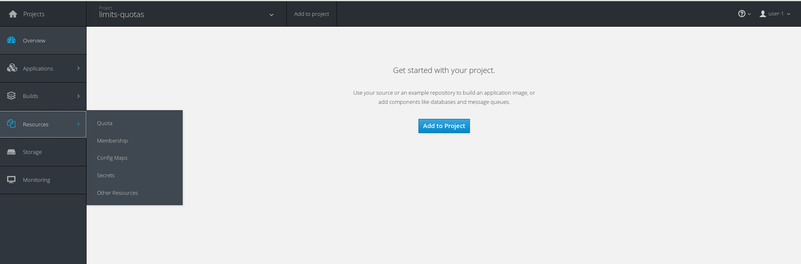
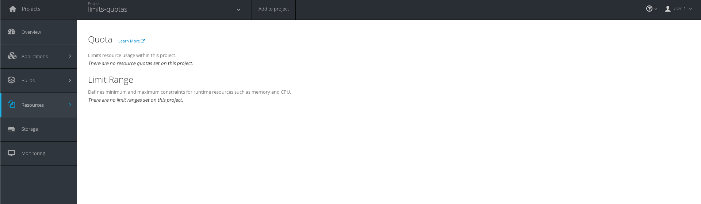
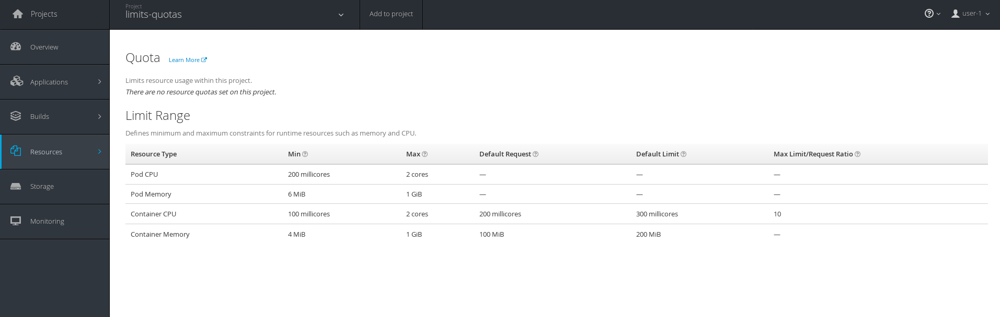
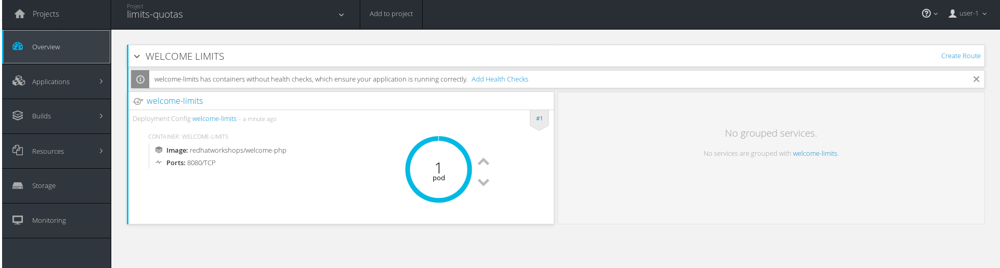

# Assigning Limit Ranges and Quotas

In this lab you will learn how to set up limit ranges and quotas. You will also learn how to assign these to project namespaces.

## Limit Ranges

Limit Ranges establish the number of compute resource constraints in a given project. These contraints affect the pod, container, image, image stream, and persistent volume claims. It specifies the amount of resources that these can consume. 

It also sets the minimum, maximum, and default resources that something can/will take.

### Step 1

Limit Ranges can be set on an existing project or a brand new projects. Depending what you do, there might be a caveat.

* **Brand New Projects** - The Limit Range will be applied immedietly.
* **Existing Projects**  - The Limit Range will be applied immedietly, and will take affect to newly created resources. Current pods will not be affected until restart.

For this exercise we will be going the "brand new project" route. Create this project called `limits-quotas`

```
oc new-project limits-quotas
Now using project "limits-quotas" on server "https://master.example.com:8443".

You can add applications to this project with the 'new-app' command. For example, try:

    oc new-app centos/ruby-22-centos7~https://github.com/openshift/ruby-ex.git

to build a new example application in Ruby.

```

Assign this  to `user-1`

```
oc policy add-role-to-user admin user-1 -n limits-quotas
role "admin" added: "user-1"
```

### Step 2

In the webui, login as `user-1`. You should see `limits-quotas` listed; click on it to go to the overview page.

On the overview page; navigage to `Resources ~> Quotas` 



It should show that there is no limits or quotas set. 



This means that any application created in this namespace can use as much resource that is available (default behavior). Now on the command-line (as `system:admin`) create a yaml file called `limits.yaml`. Populate it with the following

```yaml
apiVersion: "v1"
kind: "LimitRange"
metadata:
  name: "resource-limits"
spec:
  limits:
    - type: "Pod"
      max:
        cpu: "2"
        memory: "1Gi"
      min:
        cpu: "200m"
        memory: "6Mi"
    - type: "Container"
      max:
        cpu: "2"
        memory: "1Gi"
      min:
        cpu: "100m"
        memory: "4Mi"
      default:
        cpu: "300m"
        memory: "200Mi"
      defaultRequest:
        cpu: "200m"
        memory: "100Mi"
      maxLimitRequestRatio:
        cpu: "10"
```

The above configurations sets the lower, upper, and default resources that can be consumned by a pod or container.

Apply this to the `limits-quotas` project you created.

```
oc create -f limits.yaml -n limits-quotas
limitrange "resource-limits" created
```

Refresh the page and you should see the limit range is now applied.



### Step 3

Now create an application and see how it affects it.

```
oc new-app redhatworkshops/welcome-php --name=welcome-limits -n limits-quotas
--> Found Docker image 3e73433 (7 months old) from Docker Hub for "redhatworkshops/welcome-php"

    chx/welcome-php-1:b68a2d86 
    -------------------------- 
    Platform for building and running PHP 5.6 applications

    Tags: builder, php, php56, rh-php56

    * An image stream will be created as "welcome-limits:latest" that will track this image
    * This image will be deployed in deployment config "welcome-limits"
    * Port 8080/tcp will be load balanced by service "welcome-limits"
      * Other containers can access this service through the hostname "welcome-limits"

--> Creating resources ...
    imagestream "welcome-limits" created
    deploymentconfig "welcome-limits" created
    service "welcome-limits" created
--> Success
    Run 'oc status' to view your app.
```

If you naviate to the overview page; you should see the application up and running.



Click on the blue circle (representing the pod), then click on "Metrics" to see the metrics overview page.

## Quotas

### Step 1

### Step X

## Conclusion

In this lab you learned how to ...
