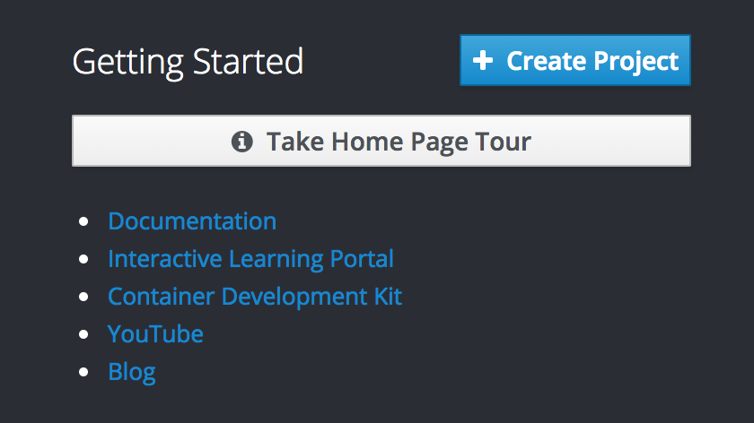
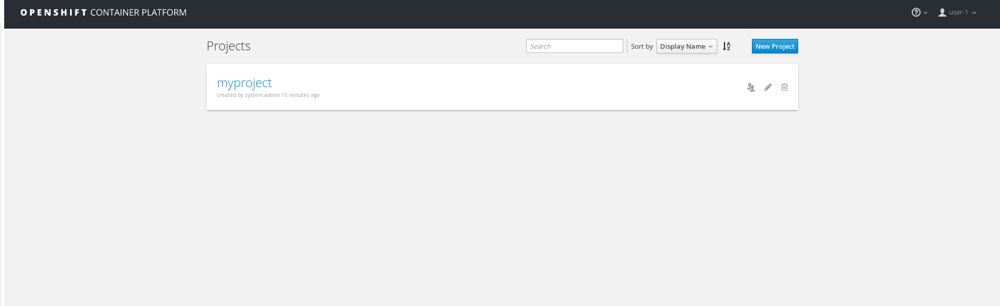
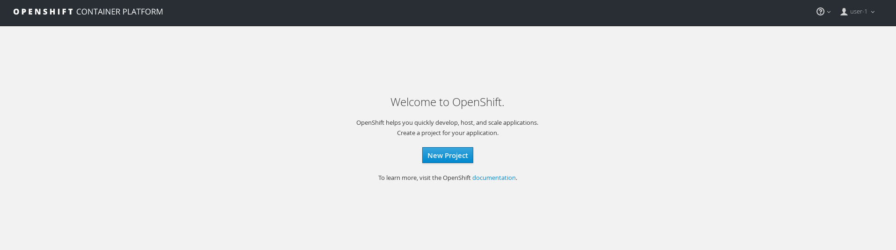
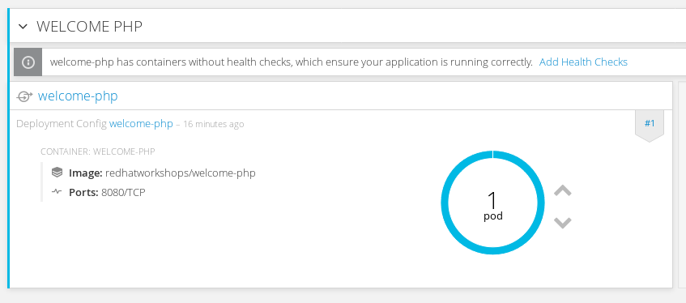
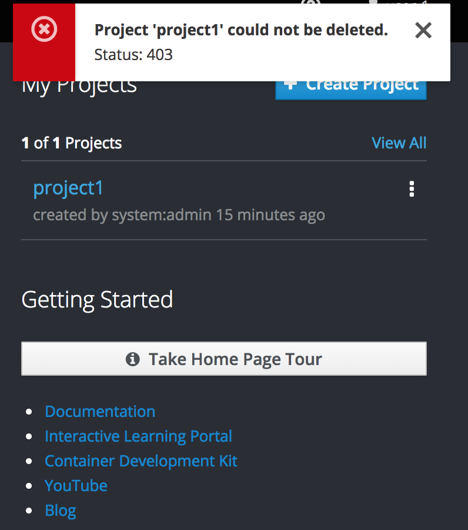
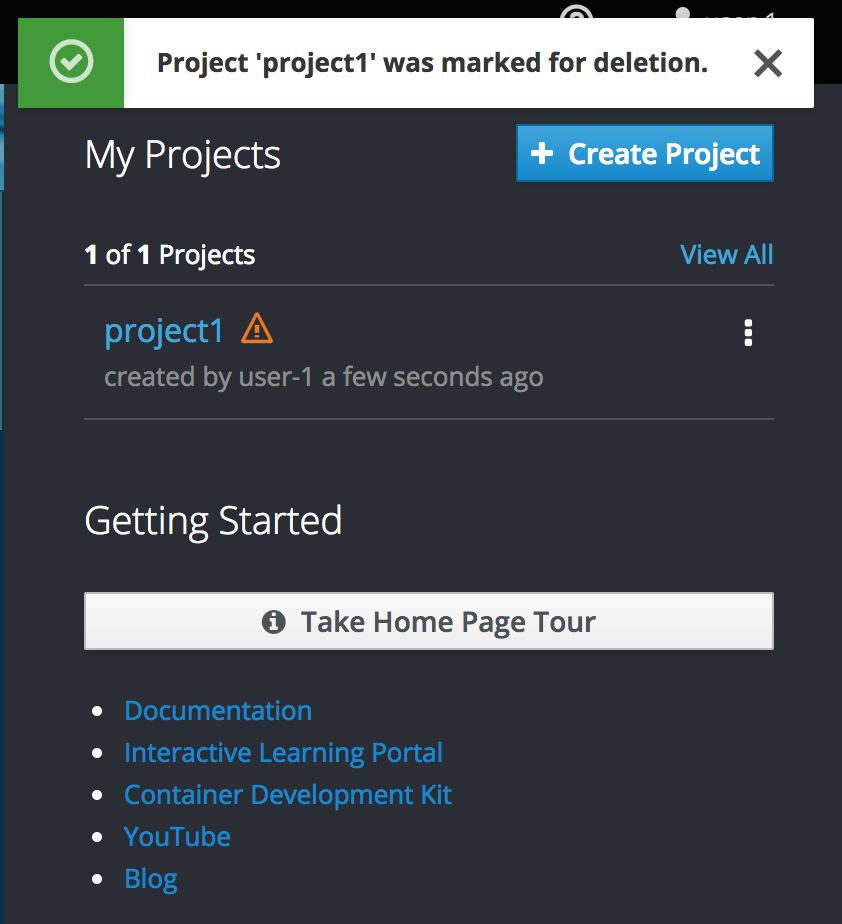

# Assigning Users to Project Roles

In this lab you will learn how to grant user access to different projects. This will get you familiar with how to enable colaboration within the OpenShift platform.

## Step 1

You will need to create a user (or if you are using LDAP, you can use an LDAP user). If you are using the default installation; create a user using the `htpasswd` command

```
htpasswd /etc/origin/openshift-passwd user-1
New password: 
Re-type new password: 
Adding password for user user-1
```

Next, as an admin (or another user), create a project and an app within that project.

```
oc whoami
system:admin

oc new-project myproject
Now using project "myproject" on server "https://master.example.com:8443".

You can add applications to this project with the 'new-app' command. For example, try:

    oc new-app centos/ruby-22-centos7~https://github.com/openshift/ruby-ex.git

to build a new example application in Ruby.

oc project myproject
Already on project "myproject" on server "https://master.example.com:8443".

oc new-app redhatworkshops/welcome-php --name=welcome-php
--> Found Docker image 3e73433 (7 months old) from Docker Hub for "redhatworkshops/welcome-php"

    chx/welcome-php-1:b68a2d86 
    -------------------------- 
    Platform for building and running PHP 5.6 applications

    Tags: builder, php, php56, rh-php56

    * An image stream will be created as "welcome-php:latest" that will track this image
    * This image will be deployed in deployment config "welcome-php"
    * Port 8080/tcp will be load balanced by service "welcome-php"
      * Other containers can access this service through the hostname "welcome-php"

--> Creating resources ...
    imagestream "welcome-php" created
    deploymentconfig "welcome-php" created
    service "welcome-php" created
--> Success
    Run 'oc status' to view your app.
```

Now, as `user-1`, login to the webui. You should be presented with a "blank slate" after you login.



## Step 2

Now we will assign the user `user-1` to be able to view the project `myproject`. We will do this with the `oc policy` command as the `system:admin` user.

```
oc whoami
system:admin

oc policy add-role-to-user view user-1 -n myproject
role "view" added: "user-1"
```

**NOTE:** Use `oc policy -h` to view all the options

Take a look at the webpage now; you should see the project "myproject" (feel free to click around).



Once you have explored; go back to the overviewpage

Remove the "view" role and see the project "myproject" no longer appears on the project list

```
oc policy remove-role-from-user view user-1 -n myproject
role "view" removed: "user-1"
```



## Step 3

Now you will grant the "edit" role to `user-1` (this supersedes any prior policy).

```
oc policy add-role-to-user edit user-1 -n myproject
role "edit" added: "user-1"
```

If you view the project overview page; you can see that you can scale up/down the application (noted with the ▲ and ▼ symbols) now that you have "edit" privilages



## Step 4

You have edit privlages for the project; but only an admin of a project can delete a project. If you try and delete the project, you will get the following error.



Grant the "admin" role to the user

```
oc policy add-role-to-user admin user-1 -n myproject
role "admin" added: "user-1"
```

Go ahead and delete this project (which deletes ALL applications and resources under the project so **MAKE SURE THIS IS WHAT YOU WANT**). 



## Conclusion

In this lab you learned how to assign and remove roles to users for specific projects. You also got familiar with what the default roles allows and what they do not allow you to do
