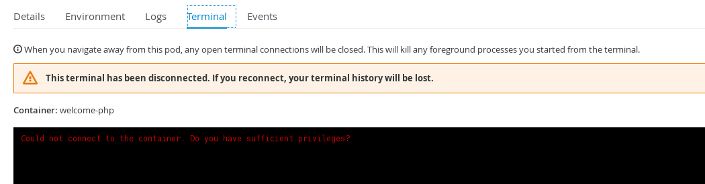

== Creating Custom Roles

In this lab you will learn how to create a custom role. As you saw in
the previous lab; operators can customize the level of access that are
granted to each user of the platform. Access can be granted at a local
(project) or cluster level. Several default roles are provided by the
platform and include:

* admin
* basic-user
* cluster-admin
* cluster-status
* edit
* self-provisioner
* view

A full description of these roles and the concepts provided by roles can
be found in the
https://docs.openshift.com/container-platform/latest/architecture/additional_concepts/authorization.html#roles[Roles
section of the documentation].

In this lab we will be doing the most common requested role.

____
``I do not want a user to be able to remote shell into their container''
____

=== Step 1

The easiest way to creating a custom role, is to find an existing role
that closely matches what you want, and edit it. In the case of ``not
being able to rsh'', the role `edit` is a good canidate.

Export this role

....
oc get clusterrole edit -o yaml > edit_role.yaml
....

If you take a look at this file, you will see the following resource
defined

....
  - pods/exec
....

This means that this role allows you execute commands
(i.e. `exec /bin/bash`) into a container.

=== Step 2

Make a copy of this exported role

....
cp edit_role.yaml edit_no_rsh_role.yaml
....

There is really only a few things to change in the file. The first is
the `name`; make sure it is unique to the environment; I named mine
`name: edit_no_rsh`. Next is to remove the `- pods/exec`.

For OpenShift versions 3.9 and higher, ClusterRoles have the ability to
be aggregated from other existing ClusterRoles to reduce redundancy
within the Role Based Access Control system. The edit ClusterRole
derives its configuration from another ClusterRole as defined by the
aggregationRule property. With this property in place, any modification
to remove privileges would automatically be reset to the default cluster
definition. To disable the aggregation of ClusterRoles for this custom
ClusterRole, remove the following lines.

....
aggregationRule:
  clusterRoleSelectors:
  - matchLabels:
      rbac.authorization.k8s.io/aggregate-to-edit: "true"
....

Once you have made those changes; run `diff` on the files; it should
look like this

....
diff --side-by-side --suppress-common-lines edit_role.yaml edit_no_rsh_role.yaml

aggregationRule:                          <
  clusterRoleSelectors:                       <
  - matchLabels:                          <
      rbac.authorization.k8s.io/aggregate-to-edit: "true"     <
  name: edit                              |   name: edit_no_rsh
  - pods/exec                             <
....

Load this into OpenShift

....
oc create -f edit_no_rsh_role.yaml 
clusterrole "edit_no_rsh" created
....

=== Step 3

Now you can assign this new role to a user. Test this by assigning
`user-1` to a project using this role (create one if you do not have
one).

....
oc policy add-role-to-user edit_no_rsh user-1 -n project1
role "edit_no_rsh" added: "user-1"
....

Login to the webui and try and run terminal commands to test that it is
working. You may have to deploy an application if a pod doesn’t exist.

=== Conclusion

In this lab you learned how to create a custom role and assigned it to a
user.
