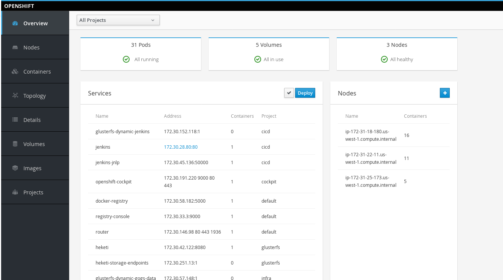

# Deploying Cockpit As A Container

In this lab you will learn how to deploy cockpit as a container. This is useful for when you have an installation (like a cloud based install) where the 'root' user is locked, does not have a password, or is otherwise unavailable.

## Step 1 - Create An Admin User

This step has two outcomes. It gives you a user that you can view information about your cluster, and it has the side effect of giving you an "admin" user (i.e. like a "root" user).

If you already have a user in mind or are going to be using an LDAP user you can skip the below command. Otherwise, create the `ocp-admin` using the below command.

```
htpasswd /etc/origin/openshift-passwd ocp-admin
```

Next (whether you are using LDAP or this `ocp-admin` user), grant the `cluster-admin` role to this user for the entire cluster.

```
oc adm policy add-cluster-role-to-user cluster-admin ocp-admin
```

## Step 2

Now that we have our user; we will create a project to house the `cockpit` interface.

```
oc new-project cockpit
oc project cockpit
```

Next, we will be using the [official cockpit](https://github.com/charlesrichard/cockpit/tree/master/containers) repoistory to create our application. This repo provides an [OpenShift Template](https://github.com/cockpit-project/cockpit/blob/master/containers/openshift-cockpit.template) for us to use. We will process this template using customer parameters.

```
cd ~
curl -O https://raw.githubusercontent.com/cockpit-project/cockpit/master/containers/openshift-cockpit.template
oc process --param="COCKPIT_KUBE_URL=https://cockpit.apps.example.com" \
--param="OPENSHIFT_OAUTH_PROVIDER_URL=https://ocp.example.com:8443" \
--param=COCKPIT_KUBE_INSECURE="false" \
--param="OPENSHIFT_OAUTH_CLIENT_ID=cockpit-oauth-webui" \
-f openshift-cockpit.template | oc create -f -
```

Few things to note

* `COCKPIT_KUBE_INSECURE` - I am setting this to `false` because I want this to go through SSL
* `COCKPIT_KUBE_URL` - This is the URL for the cockpit route I want to use (note the use of `https://`)
* `OPENSHIFT_OAUTH_PROVIDER_URL` - This should be set to your master console URL.
* `OPENSHIFT_OAUTH_CLIENT_ID` - This is a uniqe name for the oauth client

Just like any OpenShift app; this creates a variety of objects. The most important being an `oauthclient`. Inspect this resource.

```
oc get oauthclient cockpit-oauth-client -o yaml
```

This should output something like this

```yaml
apiVersion: v1
kind: OAuthClient
metadata:
  creationTimestamp: 2017-07-20T21:17:07Z
  labels:
    createdBy: cockpit-openshift-template
  name: cockpit-oauth-client
  resourceVersion: "3540070"
  selfLink: /oapi/v1/oauthclients/cockpit-oauth-client
  uid: c8f7bf45-6d90-11e7-9df9-02085f46c5fa
redirectURIs:
- https://cockpit.apps.example.com/
secret: user772sFA51njDJdTd3kvjGnOYfuxqQtSwhxiOMO3J2JossdH8Kr1IndqmylrxQSkqJ
```

This is basically saying "Anytime someone visits `https://cockpit.apps.example.com/`, use OpenShift's oauth for authentication".

Verify the pod is running

```
oc get pods -n cockpit
NAME                        READY     STATUS    RESTARTS   AGE
openshift-cockpit-1-fh49x   1/1       Running   0          13m
```

Now create the route

```
oc create route passthrough --service=openshift-cockpit --hostname=cockpit.apps.example.com --port=9090 --insecure-policy=Redirect openshift-cockpit
```

## Step 3

This step allows you to play around a bit. Visit your cockpit interface at the route you specified (in this example it is: `https://cockpit.apps.example.com/`). You will notice that it redirects you to the familiar OpenShift login page. Login using the `ocp-admin` (or whichever user you used).

This should redirect you to the cockpit overview page



Feel free to play around and see information about your entire cluster. This gives information about

* Nodes
* Containers (and the ability to shell to them)
* Topology
* Detailed information about objects
* Volumes
* Images from your Registry
* Detailed infromation about Projects

## Conclusion

In this lab you learned how to create a user that has admin privilages (that is to say, how to asign a new "root" user). You also got an overview how OpenShift can be used to "offload" authentication by using its oauth client capabilites.

You also got a view on how an administrator can see information about the OpenShift cluster at a glance.
