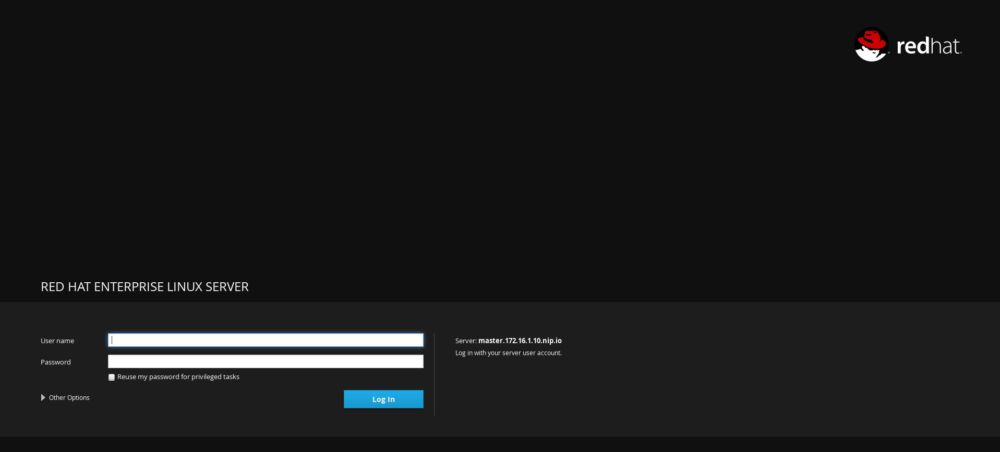
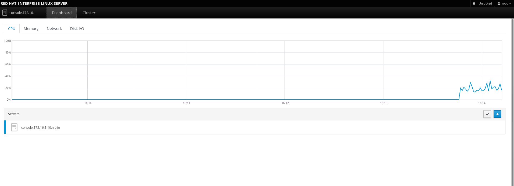
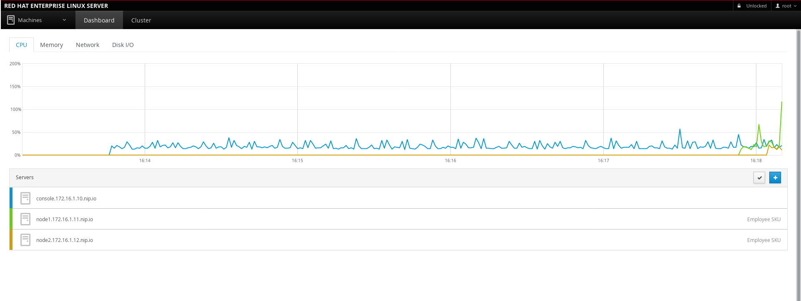
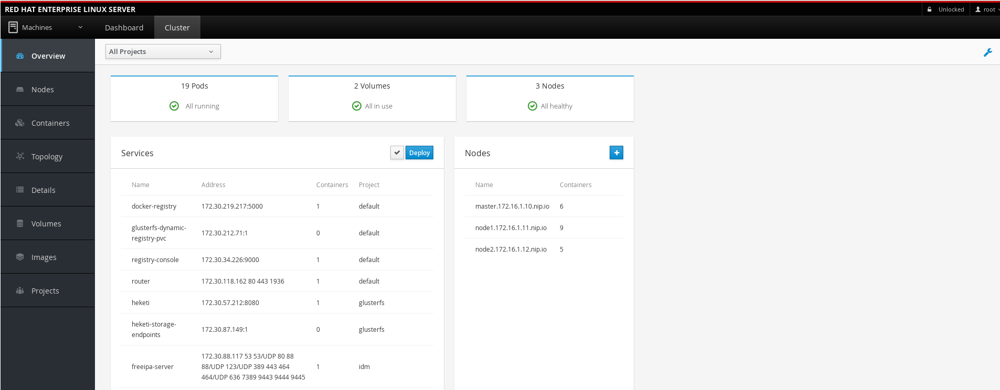

== Installing and Using Cockpit

In this lab you will learn how to install Cockpit; which can be seen as
the ``Administration Page'' for OpenShift. It contains tools to manage
your cluster plus a plugin for Kubernetes.

*NOTE:* This lab REQUIRES that you have the `root` login enabled with a
password. If you are on a cloud installation or if you would rather not
use the `root` account; please see
link:deploying_cockpit_as_a_container.md[how to deploy Cockpit as a
container].

=== Step 1

You will need to install the proper packages on all servers taking part
of the cluster (including the master). You can do this leverging
ansible.

....
ansible all -m shell -a "yum -y install cockpit-*"
....

Enable the `cockpit.socket` to start up the webui. Do this on the master
only.

....
systemctl enable cockpit.socket
....

=== Step 2

Navigate to your master on port 9090 (for example; mine was
`https://master.example.com:9090`) on your web browser. It should look
something like this.

Here you need to login as `root`. Once you have logged in, click on the
``Dashboard'' tab to see the overview page.

On this page you want to add the rest of your cluster using the blue
``+'' sign. On the commandline; list the servers that are part of your
cluster.

....
oc get nodes
NAME                        STATUS    AGE
master.example.com          Ready     47d
node1.example.com           Ready     47d
node2.example.com           Ready     47d
....

Add these one by one (if you have SSH keys set up; no password is
needed!). In the end it should look like this.

If you click on the ``Cluster'' tab you will see information about your
OpenShift cluster.

=== Step 3

Feel free to click around! See how you can leverage this interface. Some
of the things you can do is

* See everyones project and containers
* Login to anyones containers for troubleshooting
* See system logs
* Manage Volumes
* View memory, cpu, disk, and network information
* Terminal into any server in the cluster
* View the OpenShift topology

=== Conclusion

In this lab you learned how to install cockpit and enable the service
socket. You also learned how to login to the web interface and add
additional nodes you want to monitor.
