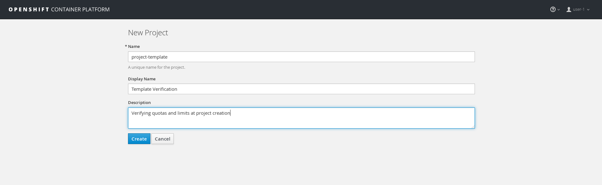
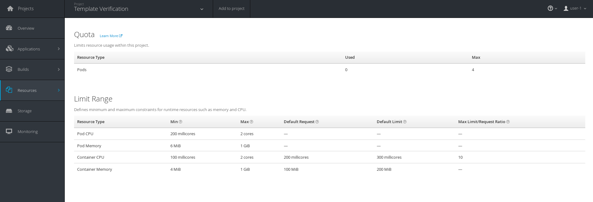

# Setting up Default Limit Ranges and Quotas for Projects

In this lab you will learn how to set it up to where OpenShift applies quotas to newly created projects.

By default OpenShift does not apply any quotas/limits to a newly created project. Instead, it leaves it up to the administrator to apply those quotas/limits. As an OpenShift adminitrator, you can configure OpenShift to set quotas to all newly created projects.

## Step 1

OpenShift uses a default template that creates a project with the requested name, and assigns the requesting user to the "admin" role for that project. You can override this using the `projectRequestTemplate` configuration in the master config file.

Rather than write a complete spec by hand, we will export the existing one.

```
oc adm create-bootstrap-project-template -o yaml > my-project-template.yaml
```

Inspect this file...you will notice items start at about line 6

```
cat my-project-template.yaml -b | head -10
     1	apiVersion: v1
     2	kind: Template
     3	metadata:
     4	  creationTimestamp: null
     5	  name: project-request
     6	objects:
     7	- apiVersion: v1
     8	  kind: Project
     9	  metadata:
    10	    annotations:
```

Here, you can insert the same configuration we used in the [quotas and limits lab](assigning_limit_ranges_and_quotas.md). Go ahead and insert those conifurations in the file.

I put the configuration towards the bottom, so the last 40 or so lines should look like this. These are added as objects in the yaml, so note the `- ` before the `apiVersion: "v1"`. Be careful about the indentation. 

```
cat -b my-project-template.yaml | tail -41
    74	- apiVersion: "v1"
    75	  kind: "LimitRange"
    76	  metadata:
    77	    name: "${PROJECT_NAME}-limits"
    78	  spec:
    79	    limits:
    80	      - type: "Pod"
    81	        max:
    82	          cpu: "2"
    83	          memory: "1Gi"
    84	        min:
    85	          cpu: "200m"
    86	          memory: "6Mi"
    87	      - type: "Container"
    88	        max:
    89	          cpu: "2"
    90	          memory: "1Gi"
    91	        min:
    92	          cpu: "100m"
    93	          memory: "4Mi"
    94	        default:
    95	          cpu: "300m"
    96	          memory: "200Mi"
    97	        defaultRequest:
    98	          cpu: "200m"
    99	          memory: "100Mi"
   100	        maxLimitRequestRatio:
   101	          cpu: "10"
   102	- apiVersion: v1
   103	  kind: ResourceQuota
   104	  metadata:
   105	    name: "${PROJECT_NAME}-quota"
   106	  spec:
   107	    hard:
   108	      pods: "4"
   109	parameters:
   110	- name: PROJECT_NAME
   111	- name: PROJECT_DISPLAYNAME
   112	- name: PROJECT_DESCRIPTION
   113	- name: PROJECT_ADMIN_USER
   114	- name: PROJECT_REQUESTING_USER
```

Note I used `"${PROJECT_NAME}-limits"` and `"${PROJECT_NAME}-quota"` for the entry of `metadata.name`. Take your time and make sure you got the spacing right.


Once you are satisfied with what you want the defaults to be; load the template into the default OpenShift namespace.

```
oc create -f my-project-template.yaml -n default
template "project-request" created
```

Make a note of the name of this project template

```
grep -A3 "kind: Template" my-project-template.yaml 
kind: Template
metadata:
  creationTimestamp: null
  name: project-request
```

In our example, it is named "project-request"...you will be needing this for the next step.

## Step 2

Next, you need to tell OpenShift to use this new template by modifying the `/etc/origin/master/master-config.yaml` configuration file.

Make a backup copy of this file (it is sort of an important file)

```
cp /etc/origin/master/master-config.yaml{,.bak}
```

Now under `projectConfig` you need to reference this new default config by editing the config to `projectRequestTemplate: "default/project-request"`. It should look something like this

```
grep -A 5 projectConfig /etc/origin/master/master-config.yaml
projectConfig:
  projectRequestTemplate: "default/project-request"
  defaultNodeSelector: region=primary
  projectRequestMessage: ""
  projectRequestTemplate: ""
  securityAllocator:
```

Restart the `atomic-openshift-master` service

```
systemctl restart atomic-openshift-master-api atomic-openshift-master-controllers
```

Verify that it is running

```
# systemctl status atomic-openshift-master-api
● atomic-openshift-master-api.service - Atomic OpenShift Master API
   Loaded: loaded (/usr/lib/systemd/system/atomic-openshift-master-api.service; enabled; vendor preset: disabled)
   Active: active (running) since Mon 2018-02-05 17:19:43 UTC; 7min ago
     Docs: https://github.com/openshift/origin
 Main PID: 25995 (openshift)
   Memory: 390.1M
   CGroup: /system.slice/atomic-openshift-master-api.service
           └─25995 /usr/bin/openshift start master api --config=/etc/origin/master/master-config.yaml --loglevel=2 --listen=https://0.0.0.0:8443 --master=https://10.0.0.4:84...

Feb 05 17:27:20 u01-master atomic-openshift-master-api[25995]: I0205 17:27:20.025440   25995 rest.go:362] Starting watch for /api/v1/pods, rv=78947 labels= fields=s...out=5m59s
Feb 05 17:27:20 u01-master atomic-openshift-master-api[25995]: I0205 17:27:20.575015   25995 rest.go:362] Starting watch for /apis/template.openshift.io/v1/template...out=6m54s
Feb 05 17:27:20 u01-master atomic-openshift-master-api[25995]: E0205 17:27:20.620723   25995 watcher.go:210] watch chan error: etcdserver: mvcc: required revision h...compacted
Feb 05 17:27:21 u01-master atomic-openshift-master-api[25995]: I0205 17:27:21.741946   25995 rest.go:362] Starting watch for /apis/template.openshift.io/v1/template...out=7m41s
Feb 05 17:27:26 u01-master atomic-openshift-master-api[25995]: I0205 17:27:26.279165   25995 rest.go:362] Starting watch for /api/v1/podtemplates, rv=79172 labels= ...out=7m14s
Feb 05 17:27:27 u01-master atomic-openshift-master-api[25995]: I0205 17:27:27.481460   25995 rest.go:362] Starting watch for /api/v1/pods, rv=78947 labels= fields=s...out=7m40s
Feb 05 17:27:34 u01-master atomic-openshift-master-api[25995]: I0205 17:27:34.311318   25995 rest.go:362] Starting watch for /apis/networking.k8s.io/v1/networkpolic...out=6m39s
Feb 05 17:27:37 u01-master atomic-openshift-master-api[25995]: I0205 17:27:37.206635   25995 rest.go:362] Starting watch for /api/v1/services, rv=78947 labels= fiel...out=8m47s
Feb 05 17:27:37 u01-master atomic-openshift-master-api[25995]: I0205 17:27:37.270339   25995 rest.go:362] Starting watch for /apis/extensions/v1beta1/networkpolicie...eout=5m1s
Feb 05 17:27:41 u01-master atomic-openshift-master-api[25995]: I0205 17:27:41.163414   25995 rest.go:362] Starting watch for /apis/network.openshift.io/v1/netnamesp...out=8m37s
Hint: Some lines were ellipsized, use -l to show in full.


# systemctl status atomic-openshift-master-controllers
● atomic-openshift-master-controllers.service - Atomic OpenShift Master Controllers
   Loaded: loaded (/usr/lib/systemd/system/atomic-openshift-master-controllers.service; enabled; vendor preset: disabled)
   Active: active (running) since Mon 2018-02-05 17:21:14 UTC; 6min ago
     Docs: https://github.com/openshift/origin
 Main PID: 26777 (openshift)
   Memory: 119.4M
   CGroup: /system.slice/atomic-openshift-master-controllers.service
           └─26777 /usr/bin/openshift start master controllers --config=/etc/origin/master/master-config.yaml --loglevel=2 --listen=https://0.0.0.0:8444

Feb 05 17:24:16 u01-master atomic-openshift-master-controllers[26777]: I0205 17:24:16.451707   26777 replication_controller.go:451] Too few "limits-quotas"/"welcome-...eating 1
Feb 05 17:24:16 u01-master atomic-openshift-master-controllers[26777]: I0205 17:24:16.463356   26777 replication_controller.go:479] Failed creation, decrementing exp...imits-1"
Feb 05 17:24:16 u01-master atomic-openshift-master-controllers[26777]: E0205 17:24:16.463396   26777 replication_controller.go:482] unable to create pods: pods "welc...: pods=4
Feb 05 17:24:16 u01-master atomic-openshift-master-controllers[26777]: E0205 17:24:16.463459   26777 replication_controller.go:422] unable to create pods: pods "welc...: pods=4
Feb 05 17:24:16 u01-master atomic-openshift-master-controllers[26777]: I0205 17:24:16.463768   26777 event.go:218] Event(v1.ObjectReference{Kind:"ReplicationController", Nam...
Feb 05 17:27:00 u01-master atomic-openshift-master-controllers[26777]: I0205 17:27:00.303784   26777 replication_controller.go:451] Too few "limits-quotas"/"welcome-...eating 1
Feb 05 17:27:00 u01-master atomic-openshift-master-controllers[26777]: I0205 17:27:00.315512   26777 replication_controller.go:479] Failed creation, decrementing exp...imits-1"
Feb 05 17:27:00 u01-master atomic-openshift-master-controllers[26777]: E0205 17:27:00.315530   26777 replication_controller.go:482] unable to create pods: pods "welc...: pods=4
Feb 05 17:27:00 u01-master atomic-openshift-master-controllers[26777]: E0205 17:27:00.315624   26777 replication_controller.go:422] unable to create pods: pods "welc...: pods=4
Feb 05 17:27:00 u01-master atomic-openshift-master-controllers[26777]: I0205 17:27:00.315635   26777 event.go:218] Event(v1.ObjectReference{Kind:"ReplicationController", Nam...
Hint: Some lines were ellipsized, use -l to show in full.

```

## Step 3

On the webui, login as `user-1` and create a new project



Under the overview page; click on `Resources ~> Quota` and see that the quotas and limits were automatically created.



## Conclusion

In this lab you learned how to edit the master configuration file in order to set the default behavior of project creation. You also learned how to export a configuration to use as a basis of a custom configuration.
