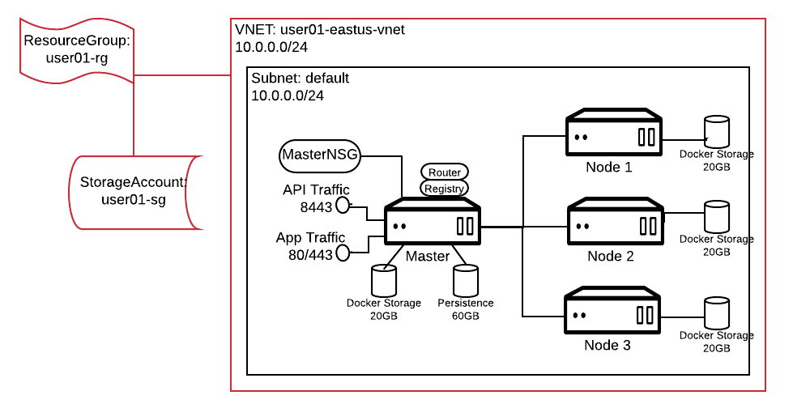

# Standing up Hosts on Azure

## Understanding the Lab environment
### Layout on Azure



### Prerequisites
* You need an account with Azure
* You should have installed Azure CLI on your workstation. Log into Azure using CLI on your workstation.
* If you are using the scripts as is, these have been created and tried on Mac. They haven't been tried on Windows, but you can try using Cygwin. The scripts are in this git repo in folder [azure_scripts](./azure_scripts).


## Network Preparation

### Set Environment Variables

For convenience let us set up the following environment variables in a file `env.sh`. **Substitute** your own values. 

```
$ cat 0.env.sh 

location=eastus
resourceGroupName=user01-rg
vnetName=user01-eastus-vnet
vnetAddressPrefix="10.0.0.0/24"
subnetName=default
subnetAddressPrefix="10.0.0.0/24"
networkSecurityGroup=user01-eastus-master-nsg
adminUserName=azure-user
adminPassword=ChangeMePleas3
storageAccountName=user01sa
```
**Note** I have used the same range for both VNet and Subnet as I don't intend to create multiple subnets. But your requirements may be different. So choose based on your needs.

**Note** Please use your own values for the username and password

### Create a Resource Group, VNet and Subnet

We will tie all the resources used by this cluster to a Resource Group. That way, removing a Resource Group will remove the entire cluster.

The following script creates a resource group, a VNet, Subnet and a Storage Account.

**Note** Currently there are issues using managed disks on Azure. It slows down the installation process with managed disks and the installs may fail. Until this issue is fixed we will use unmanaged disks. Hence we need Storage Account.

```
$ cat 1.createRgVnetSubnetSg.sh 

#!/bin/bash
echo "setting environment variables"
source 0.env.sh

echo "creating resource group"
az group create --location $location --resource-group $resourceGroupName

echo "creating vnet and subnet"
az network vnet create \
  --resource-group $resourceGroupName  \
  --location $location \
  --name $vnetName \
  --address-prefix $vnetAddressPrefix \
  --subnet-name $subnetName \
  --subnet-prefix $subnetAddressPrefix

az storage account create \
--resource-group $resourceGroupName \
--location $location \
--name $storageAccountName \
--sku Premium_LRS
```

Let us run the script to create these resources

```
$ source 1.createRgVnetSubnet.sh 

setting environment variables
creating resource group
{
  "id": "/subscriptions/e7dd9e95-c878-42f8-91d7-61cbc5d26c67/resourceGroups/user01-rg",
  "location": "eastus",
  "managedBy": null,
  "name": "user01-rg",
  "properties": {
    "provisioningState": "Succeeded"
  },
  "tags": null
}
creating vnet and subnet
{
  "newVNet": {
    "addressSpace": {
      "addressPrefixes": [
        "10.0.0.0/24"
      ]
    },
    "dhcpOptions": {
      "dnsServers": []
    },
    "enableDdosProtection": false,
    "enableVmProtection": false,
    "etag": "W/\"a0406f7d-b3b2-4c0f-8678-1224d367ae53\"",
    "id": "/subscriptions/e7dd9e95-c878-42f8-91d7-61cbc5d26c67/resourceGroups/user01-rg/providers/Microsoft.Network/virtualNetworks/user01-eastus-vnet",
    "location": "eastus",
    "name": "user01-eastus-vnet",
    "provisioningState": "Succeeded",
    "resourceGroup": "user01-rg",
    "resourceGuid": "1a0e5674-4442-4ba1-9c8b-756aaabeeabe",
    "subnets": [
      {
        "addressPrefix": "10.0.0.0/24",
        "etag": "W/\"a0406f7d-b3b2-4c0f-8678-1224d367ae53\"",
        "id": "/subscriptions/e7dd9e95-c878-42f8-91d7-61cbc5d26c67/resourceGroups/user01-rg/providers/Microsoft.Network/virtualNetworks/user01-eastus-vnet/subnets/default",
        "ipConfigurations": null,
        "name": "default",
        "networkSecurityGroup": null,
        "provisioningState": "Succeeded",
        "resourceGroup": "user01-rg",
        "resourceNavigationLinks": null,
        "routeTable": null,
        "serviceEndpoints": null
      }
    ],
    "tags": {},
    "type": "Microsoft.Network/virtualNetworks",
    "virtualNetworkPeerings": []
  }
```


## Adding Virtual Machines 

We will use two types of virtual machines. 

### Master Host
For the master we will create a host that uses a PublicIP and a Network Security Group that opens up specific ports for connectivity. The following script creates such a VM.

```
$ cat 2a.createHostWithPublicIPandNSG.sh
 
#!/bin/bash

echo "creating network security group and network security rules"
source 2c.createNetworkSecurityGroup.sh

echo "creating Master VM with two extra disks"
az vm create --resource-group $resourceGroupName \
    --name $vmName \
    --location $location \
    --size $vmSize \
    --subnet $subnetName \
    --vnet-name $vnetName \
    --nsg $networkSecurityGroup \
    --image RHEL \
    --storage-account $storageAccountName \
    --use-unmanaged-disk \
    --admin-username $adminUserName \
    --ssh-key-value ~/.ssh/id_rsa.pub \
    --public-ip-address-allocation static \
    --public-ip-address $publicIPName 

az vm unmanaged-disk attach --resource-group $resourceGroupName --vm-name $vmName --new --size-gb 20
az vm unmanaged-disk attach --resource-group $resourceGroupName --vm-name $vmName --new --size-gb 60
 
```

The commands above create a VM 

* attaching two extra unmanaged disks of sizes 20GB and 60GB
* uses the value set for adminUserName as the username to log onto the host
* uses your ssh-key from `~/.ssh/id_rsa.pub` for passwordless login. **If your key is different, change it.**
* allocates a static PublicIP to the host


Note that this script creates a Network Security Group for the master and adds the rules to open specific ports 

* Port 80
* Port 443
* Port 8443
* Port 2379
* Port 9090
* Port 22

```
$ cat 2c.createNetworkSecurityGroup.sh 

az network nsg create --resource-group $resourceGroupName \
      --name $networkSecurityGroup \
      --location $location

az network nsg rule create --resource-group $resourceGroupName \
    --nsg-name $networkSecurityGroup \
    --name allow-https \
    --description "Allow access to port 443 for HTTPS" \
    --protocol Tcp \
    --source-address-prefix \* \
    --source-port-range \* \
    --destination-address-prefix \* \
    --destination-port-range 443 \
    --access Allow \
    --priority 102 \
    --direction Inbound
az network nsg rule create --resource-group $resourceGroupName \
    --nsg-name $networkSecurityGroup \
    --name allow-http \
    --description "Allow access to port 80 for HTTP" \
    --protocol Tcp \
    --source-address-prefix \* \
    --source-port-range \* \
    --destination-address-prefix \* \
    --destination-port-range 80 \
    --access Allow \
    --priority 112 \
    --direction Inbound
az network nsg rule create --resource-group $resourceGroupName \
    --nsg-name $networkSecurityGroup \
    --name allow-master-api \
    --description "Allow access to port 8443" \
    --protocol Tcp \
    --source-address-prefix \* \
    --source-port-range \* \
    --destination-address-prefix \* \
    --destination-port-range 8443 \
    --access Allow \
    --priority 122 \
    --direction Inbound
az network nsg rule create --resource-group $resourceGroupName \
    --nsg-name $networkSecurityGroup \
    --name allow-etcd \
    --description "Allow access to port 2379" \
    --protocol Tcp \
    --source-address-prefix \* \
    --source-port-range \* \
    --destination-address-prefix \* \
    --destination-port-range 2379 \
    --access Allow \
    --priority 132 \
    --direction Inbound
az network nsg rule create --resource-group $resourceGroupName \
    --nsg-name $networkSecurityGroup \
    --name allow-cockpit \
    --description "Allow access to port 9090" \
    --protocol Tcp \
    --source-address-prefix \* \
    --source-port-range \* \
    --destination-address-prefix \* \
    --destination-port-range 9090 \
    --access Allow \
    --priority 142 \
    --direction Inbound
az network nsg rule create --resource-group $resourceGroupName \
    --nsg-name $networkSecurityGroup \
    --name default-allow-ssh \
    --description "Allow access to port 22" \
    --protocol Tcp \
    --source-address-prefix \* \
    --source-port-range \* \
    --destination-address-prefix \* \
    --destination-port-range 22 \
    --access Allow \
    --priority 152 \
    --direction Inbound
```
**Note** we haven't run any of these commands yet

### Node Host

For the node hosts, we will add VMs without PublicIps. We will setup so that all the network access between the nodes happens using PrivateIPs assigned to these hosts. So we don't need to open and special external ports in the Network Security Group. We will let Azure create its own NSG with the defaults.

```
$ cat 2b.createHost.sh 

#!/bin/bash

az vm create --resource-group $resourceGroupName \
    --name $vmName \
    --location $location \
    --size $vmSize \
    --subnet $subnetName \
    --vnet-name $vnetName \
    --public-ip-address "" \
    --image RHEL \
    --storage-account $storageAccountName \
    --use-unmanaged-disk \
    --admin-username $adminUserName \
    --authentication-type password \
    --admin-password $adminPassword

az vm unmanaged-disk attach --resource-group $resourceGroupName --vm-name $vmName --new --size-gb 20


```
The above commands create a VM 

* with no PublicIP
* attach an extra unmanaged disk of size 20GB
* uses the value set for `adminUserName` as the username to log onto the host
* uses password based authentication using the value set for `adminPassword`

Since this is machine doesnt have a PublicIP you cannot login to this box from your workstation. You have to be within the VNet to access this box.

**Note** we haven't run any of these commands yet

### Add Hosts

I have a small script that calls the above two scripts to create the hosts and it uses the content in a configuration file named `hostsinfo.txt`

**Note** This script is just created for convenience and may not be resilient enough to meet all your needs. Use it at your own risk!!

If there is a need for PublicIP it calls `2a.createHostWithPublicIPandNSG.sh`, otherwise it calls `2b.createHost.sh`

```
$ cat 2.addAzureHosts.sh 

#!/bin/bash
  
source env.sh

while read -r line; 
    do 
      declare $line; 
      printf "Adding VM %s of size %s with publicIP " $vmName $vmSize; 
           [[ -z $publicIPName ]] && { printf "none "; } || { printf "%s " $publicIPName; }; 
           [[ -z $networkSecurityGroup ]] && { printf "NetworkSecurityGroup autogenerated\n"; } || { printf "NetworkSecurityGroup %s\n" $networkSecurityGroup; };
      
     if [ ! -z $publicIPName ]
     then
       source 2a.createHostWithPublicIPandNSG.sh
     else
       source 2b.createHost.sh
     fi 
    done < hostsinfo.txt

source 3.getHostIPAddresses.sh
```

Here is the configuration file through which we provide the list of hosts to spin up.

```
$ cat hostsinfo.txt
 
vmName=u01-master vmSize=Standard_DS12_V2 networkSecurityGroup=master-NSG publicIPName=masterPublicIP
vmName=u01-node1 vmSize=Standard_DS12_V2 networkSecurityGroup= publicIPName=
vmName=u01-node2 vmSize=Standard_DS12_V2 networkSecurityGroup= publicIPName=
vmName=u01-node3 vmSize=Standard_DS12_V2 networkSecurityGroup= publicIPName=
```
This file provides HostName, Size, NetworkSecurityGroup and PublicIPName for each host on a separate line. The values are left empty when not used i.e, for nodes we are not providing NSG and PublicIP.

Let us run the script to create the VMs.

```
$ source 2.addAzureHosts.sh 

...
...
Adding VM u01-node3 of size Standard_DS12_V2 with publicIP none NetworkSecurityGroup autogenerated
{
  "fqdns": "",
  "id": "/subscriptions/e7dd9e95-c878-42f8-91d7-61cbc5d26c67/resourceGroups/user01-rg/providers/Microsoft.Compute/virtualMachines/u01-node3",
  "location": "eastus",
  "macAddress": "00-0D-3A-18-DA-78",
  "powerState": "VM running",
  "privateIpAddress": "10.0.0.7",
  "publicIpAddress": "",
  "resourceGroup": "user01-rg",
  "zones": ""
}
u01-master PrivateIP: 10.0.0.4 PublicIP: 13.92.87.188
u01-node1 PrivateIP: 10.0.0.5 PublicIP: 
u01-node2 PrivateIP: 10.0.0.6 PublicIP: 
u01-node3 PrivateIP: 10.0.0.7 PublicIP: 

```

You will see the PrivateIPs assigned to all the hosts and the PublicIP assinged to master. Make a note of these. You will need them later.

### Finding Host IP Addresses

If you ever want to get this list again the following script is useful:

```
$ cat 3.getHostIPAddresses.sh 

for i in $(az vm list --resource-group $resourceGroupName --query "[].name" -o tsv); do \
   export privIP=$(az vm show -d --name $i --resource-group $resourceGroupName --query "privateIps" -o tsv); \
   export publIP=$(az vm show -d --name $i --resource-group $resourceGroupName --query "publicIps" -o tsv); \
   printf "%s PrivateIP: %s PublicIP: %s\n" $i $privIP $publIP; \
done
```

and you can run it again

```
$ source 3.getHostIPAddresses.sh 
u01-master PrivateIP: 10.0.0.4 PublicIP: 13.92.87.188
u01-node1 PrivateIP: 10.0.0.5 PublicIP: 
u01-node2 PrivateIP: 10.0.0.6 PublicIP: 
u01-node3 PrivateIP: 10.0.0.7 PublicIP: 
```

## Manage Hosts

### Stop Hosts

Here is the script

```
$ cat 4.stopAzureHosts.sh 

#!/bin/bash
  
source 0.env.sh

while read -r line;
    do
      declare $line;
      printf "Stopping VM %s \n" $vmName;
        az vm deallocate --no-wait --name $vmName --resource-group $resourceGroupName
    done < hostsinfo.txt
az vm list --resource-group $resourceGroupName -d --query '[].[name,powerState]' -o tsv
```

Run

```
$ source 4.stopAzureHosts.sh 

Stopping VM u01-master 
Stopping VM u01-node1 
Stopping VM u01-node2 
Stopping VM u01-node3 
u01-master	VM deallocating
u01-node1	VM deallocating
u01-node2	VM deallocating
u01-node3	VM deallocating
```

### Check the Power State

```
$ az vm list --resource-group $resourceGroupName -d --query '[].[name,powerState]' -o tsv

u01-master	VM deallocated
u01-node1	VM deallocated
u01-node2	VM deallocated
u01-node3	VM deallocated
```

### Start Hosts

Here is the script

```
$ cat 5.startAzureHosts.sh 
#!/bin/bash
  
source 0.env.sh

while read -r line;
    do
      declare $line;
      printf "Starting VM %s \n" $vmName;
        az vm start --no-wait --name $vmName --resource-group $resourceGroupName
    done < hostsinfo.txt

az vm list --resource-group $resourceGroupName -d --query '[].[name,powerState]' -o tsv
```

Run

```
$ source 5.startAzureHosts.sh 

Starting VM u01-master 
Starting VM u01-node1 
Starting VM u01-node2 
Starting VM u01-node3 
u01-master	VM starting
u01-node1	VM starting
u01-node2	VM starting
u01-node3	VM starting
```

### Remove Hosts

To remove hosts (**use with caution**)

```
$ cat 6.removeAzureHosts 

#!/bin/bash
  
source 0.env.sh

while read -r line;
    do
      declare $line;
      printf "Deleting VM %s of size %s with publicIP " $vmName $vmSize;
           [[ -z $publicIPName ]] && { printf "none "; } || { printf "%s " $publicIPName; };
           [[ -z $networkSecurityGroup ]] && { printf "NetworkSecurityGroup autogenerated\n"; } || { printf "NetworkSecurityGroup %s\n" $networkSecurityGroup; };

       sh 6a.delVM.sh $vmName $resourceGroupName
    done < hostsinfo.txt

```

Run 

```
$ source 6.removeAzureHosts
```


## Clean up your environment 

**USE WITH EXTREME CAUTION** 

If you want to clean up everything i.e, VMs, PublicIPs, Subnet, VNet etc, you can just delete the resource group and all the resources associated with will be removed.

```
$ az group delete --resource-group $resourceGroupName
```

