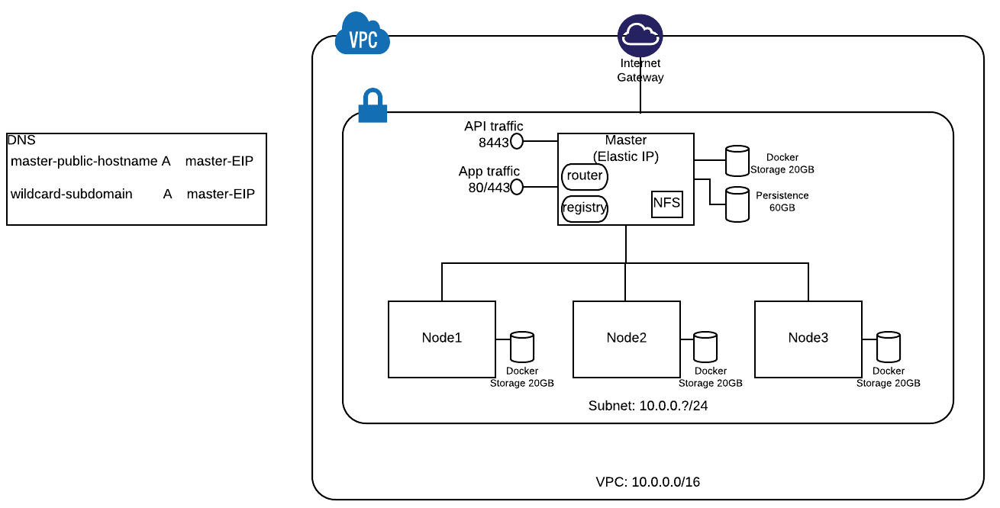

# Standing up Hosts on AWS EC2

## Understanding the Lab environment
#### Layout on AWS



#### POC Prerequisites
*to be added*

**Note** Standing up OpenShift on AWS has been all automated by running a script. 

*Add Link*
We are doing it step-by-step in this lab, so that you know every aspect of doing a POC in a customer's environment. The customer environment will be most likely on VMs. Since currently we cannot provide you such an environment, we are using AWS. Hence learning the whole nine yards will give a good idea of what is involved.


## Instructor's tasks

Your instructor did the following for you. The steps in this section below are for information. These are documented here so that you know what to do if you are standing up everything yourself. You should not run these steps. Your steps are in the next section.

#### Create a New VPC
The reference architecture uses a VPC for each cluster. But due to limitations on the lab environment, we will share one VPC across all the clusters. Each user will create their own Subnet within the VPC provided by the instructor.

Here is an example of how the instructor created a VPC

```
$ export AWS_ACCESS_KEY_ID=<your aws key>
$ export AWS_SECRET_ACCESS_KEY=<your aws secret>
$ aws ec2 create-vpc --cidr-block 10.0.0.0/16 --region=us-east-2 
{
    "Vpc": {
        "VpcId": "vpc-43b9942a", 
        "InstanceTenancy": "default", 
        "Tags": [], 
        "CidrBlockAssociationSet": [
            {
                "AssociationId": "vpc-cidr-assoc-7093df19", 
                "CidrBlock": "10.0.0.0/16", 
                "CidrBlockState": {
                    "State": "associated"
                }
            }
        ], 
        "Ipv6CidrBlockAssociationSet": [], 
        "State": "pending", 
        "DhcpOptionsId": "dopt-359f745c", 
        "CidrBlock": "10.0.0.0/16", 
        "IsDefault": false
    }
}

$ export EC2_VPC_ID=$(aws ec2 describe-vpcs --region=us-east-2 --output=text | grep 10.0.0.0 | awk '{print $7}')

$ echo $EC2_VPC_ID
vpc-43b9942a

$ aws ec2 create-tags --resources $EC2_VPC_ID  --tags 'Key=Name,Value=ops-day'

```
The VPC was created with a huge CIDR block `10.0.0.0/16` in the above example,  that provides 65536 IP addresses. Each of you will get a small CIDR block to use for your individual subnets.


#### Establish Internet Connectivity to your VPC

This will allow internet connectivity to the VPC.

Create an internet gateway

```
export EC2_INTERNET_GATEWAY_ID=$(aws ec2 create-internet-gateway|grep InternetGatewayId|awk '{print $2}'|sed -e 's/^"//' -e 's/",$//')

$ echo $EC2_INTERNET_GATEWAY_ID
igw-d2f199bb
```

Attach internet gateway to VPC that was created in the last section

```
$ aws ec2 attach-internet-gateway --internet-gateway-id $EC2_INTERNET_GATEWAY_ID --vpc-id $EC2_VPC_ID
```

Create Route table 

```
$ export EC2_ROUTE_TABLE_ID=$(aws ec2 create-route-table --vpc-id $EC2_VPC_ID | grep RouteTableId | awk '{print $2}'| sed -e 's/^"//' -e 's/",$//')

$ echo $EC2_ROUTE_TABLE_ID
rtb-db8385b2
```

Create a route in the route table that points all traffic (`0.0.0.0/0`) to the Internet gateway.

```
$ aws ec2 create-route --route-table-id $EC2_ROUTE_TABLE_ID --destination-cidr-block 0.0.0.0/0 --gateway-id $EC2_INTERNET_GATEWAY_ID
{
    "Return": true
}

$ echo $EC2_INTERNET_GATEWAY_ID
igw-d2f199bb

$ aws ec2 describe-route-tables --route-table-id $EC2_ROUTE_TABLE_ID
{
    "RouteTables": [
        {
            "Associations": [], 
            "RouteTableId": "rtb-db8385b2", 
            "VpcId": "vpc-43b9942a", 
            "PropagatingVgws": [], 
            "Tags": [], 
            "Routes": [
                {
                    "GatewayId": "local", 
                    "DestinationCidrBlock": "10.0.0.0/16", 
                    "State": "active", 
                    "Origin": "CreateRouteTable"
                }, 
                {
                    "GatewayId": "igw-d2f199bb", 
                    "DestinationCidrBlock": "0.0.0.0/0", 
                    "State": "active", 
                    "Origin": "CreateRoute"
                }
            ]
        }
    ]
}
```
The above shows GatewayId igw-* which is the route we just added. 

## Your (Trainee's) tasks

Each trainee will get the following information from the instructor

* **AWS Login URL and Credentials**
* **AWS Region** (example: us-east-2)	
* **VPC ID** This will be alphanumeric (example: vpc-43b9942a)
* **CIDR block** for your subnet. Each participants gets a block. (example: 10.0.0.1/24)
* **Route Table Id** (example: rtb-db8385b2)
* **RHEL AMI Id** (example: ami-cfdafaaa)	

	You can do this setup using AWS Webconsole or using CLI. The instructions below are for CLI for the simple reason that it is easier to document and maintain (rather than dealing with all those screen shots). If you are more comfortable with AWS Web Console, please feel free to use with the instructions below as your guidelines. But you are on your own!!! AMI id for RHEL-7.4 GA can be found here (https://access.redhat.com/articles/3135091)
	
**STRONGLY SUGGESTED** Please open your own favorite notepad tool and capture the results of every step. It gives you a way to go back in case you did any mistake or if you loose the session.

### Prepare our AWS Environment

These are your setup tasks before you start creating your VMs on AWS.

#### Add Environment variables

Add the following environment variables to your CLI session. This will make our life easy

```
$ export EC2_VPC_ID= <<substitute the VPC ID from instructor>>
$ export EC2_CIDR_BLOCK=<<substitute the subnet CIDR block from instructor>>
$ export EC2_ROUTE_TABLE_ID=<<substitute the Route table id from instructor>>
$ export EC2_RHEL_AMI=<<substitute the RHEL AMI ID from instructor>>
 
```

#### Setup AWS CLI

Instructions to set up AWS CLI are here

[http://docs.aws.amazon.com/cli/latest/userguide/cli-chap-getting-started.html
](http://docs.aws.amazon.com/cli/latest/userguide/cli-chap-getting-started.html)

If you are using MAC, it is much simpler. Run the following commands

```
$ brew install python3
$ brew upgrade python3
$ brew install awscli
$ aws --version
aws-cli/1.11.160 Python/2.7.10 Darwin/17.0.0 botocore/1.7.18
```

Log into the AWS Webconsole from your web browser using the credentials given by the instructor.

* Select IAM icon
* Select Users on the next page
* Choose your IAM user name
* Choose Security Credentials tab
* Click on Create Access Key and note the values for
	* **Access Key Id**
	* **Secret Access Key**

From the command line on your workstation, run `aws configure` to configure the defaults for the AWS CLI

```
$ aws configure
AWS Access Key ID [None]:  <<paste the value noted above>>
AWS Secret Access Key [None]: <<paste the value noted above>>
Default region name [None]: <<type region given by your instructor>>
Default output format [None]: json
```

Credentials and defaults are stored in

```
$ ls ~/.aws/credentials 
/Users/veer/.aws/credentials

$ cat ~/.aws/config 
[default]
output = json
region = us-east-2

```

**Optional:** Enabling AWS command completion

```
$ which aws_completer
/usr/local/bin/aws_completer
$ complete -C '/usr/local/bin/aws_completer' aws
$ aws sTAB
s3               sdb              ses              sms              sns              ssm              storagegateway   support          
s3api            servicecatalog   shield           snowball         sqs              stepfunctions    sts              swf   
```


#### Create a Security Group

To see the existing security groups in the VPC, you can run the following command. At a minimum there will be at least one "default" security group that gets created when a VPC is created. If you don't create a new security group and assign to your instances, this default group gets assigned.

```
$ aws ec2 describe-security-groups --filters Name=vpc-id,Values=$EC2_VPC_ID
{
    "SecurityGroups": [
        {
            "IpPermissionsEgress": [
                {
                    "IpProtocol": "-1", 
                    "PrefixListIds": [], 
                    "IpRanges": [
                        {
                            "CidrIp": "0.0.0.0/0"
                        }
                    ], 
                    "UserIdGroupPairs": [], 
                    "Ipv6Ranges": []
                }
            ], 
            "Description": "default VPC security group", 
            "IpPermissions": [
                {
                    "IpProtocol": "-1", 
                    "PrefixListIds": [], 
                    "IpRanges": [], 
                    "UserIdGroupPairs": [
                        {
                            "UserId": "701119495576", 
                            "GroupId": "sg-6764c60f"
                        }
                    ], 
                    "Ipv6Ranges": []
                }
            ], 
            "GroupName": "default", 
            "VpcId": "vpc-43b9942a", 
            "OwnerId": "701119495576", 
            "GroupId": "sg-6764c60f"
        }
    ]
}
```

Now add your own security group to this VPC. Name this uniquely (perhaps with your username) so that we can recognize it.

```
$ export EC2_SECURITY_GROUP=veer-ocp-sg

$ aws ec2 create-security-group --group-name $EC2_SECURITY_GROUP --description "security group for ocp cluster" --vpc-id $EC2_VPC_ID
{
    "GroupId": "sg-0e72d066"
}

$ export EC2_SECURITY_GROUP_ID=$( aws ec2 describe-security-groups --filters Name=group-name,Values=$EC2_SECURITY_GROUP --query "SecurityGroups[].GroupId" --output=text)

$ echo $EC2_SECURITY_GROUP_ID
sg-0e72d066
```

We are using a single Master that will also act as an infrastructure node. This host will need a Public IP and we will configure it to allow the following traffic:	

* **SSH**  	TCP Port 22
* **ICMP**
* **HTTP** 	TCP Port 80  (Traffic to Router)
* **HTTPS** TCP Port 443 (Traffic to Router)
* **HTTPS** TCP Port 8443 (Traffic to Master API and Webconsole)
* TCP Port 9090 

We will add these as Ingress to our Security Group and assign this SecurityGroup while creating a VM instance.			
So, let's add Ingress rules to this Security Group

```
$ aws ec2 authorize-security-group-ingress --group-id $EC2_SECURITY_GROUP_ID --protocol tcp --port 22 --cidr 0.0.0.0/0
$ aws ec2 authorize-security-group-ingress --group-id $EC2_SECURITY_GROUP_ID --protocol icmp --port -1 --cidr 0.0.0.0/0 
$ aws ec2 authorize-security-group-ingress --group-id $EC2_SECURITY_GROUP_ID --protocol tcp --port 443 --cidr 0.0.0.0/0
$ aws ec2 authorize-security-group-ingress --group-id $EC2_SECURITY_GROUP_ID --protocol tcp --port 8443 --cidr 0.0.0.0/0
$ aws ec2 authorize-security-group-ingress --group-id $EC2_SECURITY_GROUP_ID --protocol tcp --port 80 --cidr 0.0.0.0/0
$ aws ec2 authorize-security-group-ingress --group-id $EC2_SECURITY_GROUP_ID --protocol tcp --port 9090 --cidr 0.0.0.0/0
```

We won't assign nodes to the above security group. Hence they will be assigned default security group. 

These two rules allow all traffic between the default security group and your security group. We can make this more specific, allowing only those ports that are required between master and nodes and ssh.

```
aws ec2 authorize-security-group-ingress --group-id $EC2_SECURITY_GROUP_ID --protocol -1 --source-group sg-6764c60f 
aws ec2 authorize-security-group-ingress --group-id sg-6764c60f --protocol -1 --source-group $EC2_SECURITY_GROUP_ID
```

You can verify the ingress rules in the security group now

```
$ aws ec2 describe-security-groups --group-id $EC2_SECURITY_GROUP_ID
{
    "SecurityGroups": [
        {
            "IpPermissionsEgress": [
                {
                    "IpProtocol": "-1", 
                    "PrefixListIds": [], 
                    "IpRanges": [
                        {
                            "CidrIp": "0.0.0.0/0"
                        }
                    ], 
                    "UserIdGroupPairs": [], 
                    "Ipv6Ranges": []
                }
            ], 
            "Description": "security group for ocp cluster", 
            "IpPermissions": [
                {
                    "PrefixListIds": [], 
                    "FromPort": 80, 
                    "IpRanges": [
                        {
                            "CidrIp": "0.0.0.0/0"
                        }
                    ], 
                    "ToPort": 80, 
                    "IpProtocol": "tcp", 
                    "UserIdGroupPairs": [], 
                    "Ipv6Ranges": []
                }, 
                {
                    "IpProtocol": "-1", 
                    "PrefixListIds": [], 
                    "IpRanges": [], 
                    "UserIdGroupPairs": [
                        {
                            "UserId": "701119495576", 
                            "GroupId": "sg-0e72d066"
                        }, 
                        {
                            "UserId": "701119495576", 
                            "GroupId": "sg-6764c60f"
                        }
                    ], 
                    "Ipv6Ranges": []
                }, 
                {
                    "PrefixListIds": [], 
                    "FromPort": 22, 
                    "IpRanges": [
                        {
                            "CidrIp": "0.0.0.0/0"
                        }
                    ], 
                    "ToPort": 22, 
                    "IpProtocol": "tcp", 
                    "UserIdGroupPairs": [], 
                    "Ipv6Ranges": []
                }, 
                {
                    "PrefixListIds": [], 
                    "FromPort": 8443, 
                    "IpRanges": [
                        {
                            "CidrIp": "0.0.0.0/0"
                        }
                    ], 
                    "ToPort": 8443, 
                    "IpProtocol": "tcp", 
                    "UserIdGroupPairs": [], 
                    "Ipv6Ranges": []
                }, 
                {
                    "PrefixListIds": [], 
                    "FromPort": 9090, 
                    "IpRanges": [
                        {
                            "CidrIp": "0.0.0.0/0"
                        }
                    ], 
                    "ToPort": 9090, 
                    "IpProtocol": "tcp", 
                    "UserIdGroupPairs": [], 
                    "Ipv6Ranges": []
                }, 
                {
                    "PrefixListIds": [], 
                    "FromPort": 443, 
                    "IpRanges": [
                        {
                            "CidrIp": "0.0.0.0/0"
                        }
                    ], 
                    "ToPort": 443, 
                    "IpProtocol": "tcp", 
                    "UserIdGroupPairs": [], 
                    "Ipv6Ranges": []
                }, 
                {
                    "PrefixListIds": [], 
                    "FromPort": -1, 
                    "IpRanges": [
                        {
                            "CidrIp": "0.0.0.0/0"
                        }
                    ], 
                    "ToPort": -1, 
                    "IpProtocol": "icmp", 
                    "UserIdGroupPairs": [], 
                    "Ipv6Ranges": []
                }
            ], 
            "GroupName": "veer-ocp-sg", 
            "VpcId": "vpc-43b9942a", 
            "OwnerId": "701119495576", 
            "GroupId": "sg-0e72d066"
        }
    ]
}
```

#### Create a Subnet

Your instructor would have given your a CIDR block that is either `/24` or `/28`. 

Refer back the VPC created by the instructor, if the VPC is set for `16` as in the examples shown above, we get `32-16=16` bits. This means we have `2^16=65636` ip addresses in total for the VPC. 

Each workshop participant gets a CIDR block. As of example these would be `10.0.0.0/24`, `10.0.1.0/24`, `10.0.2.0/24` etc  

If you got a CIDR block of `/24` for your subnet, you get `32-24=8` bits gives `255` ip addresses per subnet i.e, you can spin up those many instances, *if your account allows*. If you are given  `/28` you get `32-24=8` bits to get just 16 ip addresses for your subnet. This means you can spin up up to 16 instances, *if your account allows*. 

```
$ aws ec2 create-subnet --vpc-id $EC2_VPC_ID --cidr-block $EC2_CIDR_BLOCK
{
    "Subnet": {
        "AvailabilityZone": "us-east-2b", 
        "AvailableIpAddressCount": 251, 
        "DefaultForAz": false, 
        "Ipv6CidrBlockAssociationSet": [], 
        "VpcId": "vpc-43b9942a", 
        "State": "pending", 
        "MapPublicIpOnLaunch": false, 
        "SubnetId": "subnet-e7f8849c", 
        "CidrBlock": "10.0.0.0/24", 
        "AssignIpv6AddressOnCreation": false
    }
}

$ export EC2_SUBNET_ID=$(aws ec2 describe-subnets --filter 'Name=vpc-id,Values='$EC2_VPC_ID'','Name=cidr-block,Values='$EC2_CIDR_BLOCK'' --query "Subnets[].SubnetId" --output=text)

$ echo $EC2_SUBNET_ID
subnet-e7f8849c
```
**Note** Substitute your own values for Value field while creating the tag below. Since each one of you are creating your own subnet, this will identify who owns which subnet.

```
$ aws ec2 create-tags --resources $EC2_SUBNET_ID --tags 'Key=Owner,Value=veer'

```

Now let's associate the Subnet with Route table. You received the Route table id from the instructor. If your subnet is associated with a route table that has a route to an Internet gateway, it's known as a public subnet.

```
$ aws ec2 associate-route-table  --subnet-id $EC2_SUBNET_ID --route-table-id $EC2_ROUTE_TABLE_ID
{
    "AssociationId": "rtbassoc-f0578698"
}
```

#### Create an Elastic IP for the Master


We will just use one Elastic IP (Public IP) to assign to the master. For this lab, OpenShift Router will be made to run on the master. Also the Master URL will be using the same IP Address. You'll make a note of this Public IP and give it to the instructor to set up DNS records for your cluster.


```
export EC2_PUBLIC_IP_ALLOCATION_ID=$(aws ec2 allocate-address | grep AllocationId | awk '{print $2}'| sed -e 's/^"//' -e 's/"$//')

$ echo $EC2_PUBLIC_IP_ALLOCATION_ID
eipalloc-27473a09

$ aws ec2 describe-addresses --filters "Name=allocation-id,Values=$EC2_PUBLIC_IP_ALLOCATION_ID"
{
    "Addresses": [
        {
            "PublicIp": "18.221.11.230", 
            "Domain": "vpc", 
            "AllocationId": "eipalloc-27473a09"
        }
    ]
}

$ export EC2_PUBLIC_IP=$(aws ec2 describe-addresses --filters "Name=allocation-id,Values=$EC2_PUBLIC_IP_ALLOCATION_ID" --query "Addresses[0].PublicIp" --output=text)

$ echo $EC2_PUBLIC_IP
18.221.11.230
```

#### Create Key Pair

Create your EC2 key pair. We will use this PEM file to SSH to EC2 Instances.
While you can save the PEM file at a location of your choice, I usually put it in .ssh folder.

**Note:** Choose your own key name. We will refer this creating EC2 instances.

```
$ export EC2_KEY_NAME=veer-ocp-key
$ aws ec2 create-key-pair --key-name $EC2_KEY_NAME --query 'KeyMaterial' --output text > ~/.ssh/ocp-aws-key.pem
$ chmod 400 ~/.ssh/ocp-aws-key.pem
```

### Spin up EC2 Instances

Amazon stores the VM Images as AMIs. We will need a RHEL AMI for our needs. The AMI Id is different for each region. Depending on the region you can login to the WebConsole, try to launch an instance and check the RHEL AMI Id. As an example [https://us-east-2.console.aws.amazon.com/ec2/v2/home?region=us-east-2#LaunchInstanceWizard:](https://us-east-2.console.aws.amazon.com/ec2/v2/home?region=us-east-2#LaunchInstanceWizard:) will give you a list of AMIs for the `us-east-2` region.


#### Spin up Master Instance

We will assign two extra disks to the Master. 
* `m4.xlarge` as the instance size
* **20GB** for Docker Storage
* **60GB** to use as Persistent storage

We will assign master the security group allocated before

We will also associate the Elastic IP to to the master

Create the Master VM

``` 
export EC2_MASTER_INSTANCE_ID=$(aws ec2 run-instances \
	 --image-id $EC2_RHEL_AMI \
 	 --count 1 \
 	 --instance-type m4.xlarge \
 	 --key-name $EC2_KEY_NAME \
 	 --security-group-ids $EC2_SECURITY_GROUP_ID \
 	 --subnet-id $EC2_SUBNET_ID \
 	 --block-device-mappings "[{\"DeviceName\":\"/dev/sdb\",\"Ebs\":{\"VolumeSize\":20,\"DeleteOnTermination\":true}}, \
        {\"DeviceName\":\"/dev/sdc\",\"Ebs\":{\"VolumeSize\":60,\"DeleteOnTermination\":true}}]" \
 	 | grep InstanceId | awk '{print $2}'| sed -e 's/^"//' -e 's/",$//')
 	
 $ echo $EC2_MASTER_INSTANCE_ID
i-0ebd354b108e2691e
```

Add tags to identify the owner and give the instance a name. 
**Note** Substitute your own username to identify yourself
```
$ aws ec2 create-tags --resources $EC2_MASTER_INSTANCE_ID --tags 'Key=Owner,Value=veer' 'Key=Name,Value=veer-master'
```

Assign Elastic IP created earlier to the Master Host and verify that the tags and PublicIP are assigned.

```
$ aws ec2 associate-address --instance-id $EC2_MASTER_INSTANCE_ID --allocation-id $EC2_PUBLIC_IP_ALLOCATION_ID
{
    "AssociationId": "eipassoc-f93f1fd7"
}


$ aws ec2 describe-instances --filter "Name=instance-id,Values=$EC2_MASTER_INSTANCE_ID"
{
    "Reservations": [
        {
            "Instances": [
                {
                    "Monitoring": {
                        "State": "disabled"
                    }, 
                    "PublicDnsName": "", 
                    "State": {
                        "Code": 16, 
                        "Name": "running"
                    }, 
                    "EbsOptimized": false, 
                    "LaunchTime": "2017-09-13T20:40:44.000Z", 
                    "PublicIpAddress": "18.221.11.230", 
                    "PrivateIpAddress": "10.0.0.86", 
                    "ProductCodes": [], 
                    "VpcId": "vpc-43b9942a", 
                    "StateTransitionReason": "", 
                    "InstanceId": "i-0ebd354b108e2691e", 
                    "EnaSupport": true, 
                    "ImageId": "ami-cfdafaaa", 
                    "PrivateDnsName": "ip-10-0-0-86.us-east-2.compute.internal", 
                    "KeyName": "veer-ocp-key", 
                    "SecurityGroups": [
                        {
                            "GroupName": "veer-ocp-sg", 
                            "GroupId": "sg-0e72d066"
                        }
                    ], 
                    "ClientToken": "", 
                    "SubnetId": "subnet-e7f8849c", 
                    "InstanceType": "m4.xlarge", 
                    "NetworkInterfaces": [
                        {
                            "Status": "in-use", 
                            "MacAddress": "06:64:b5:1b:73:24", 
                            "SourceDestCheck": true, 
                            "VpcId": "vpc-43b9942a", 
                            "Description": "", 
                            "NetworkInterfaceId": "eni-bcbfa7ee", 
                            "PrivateIpAddresses": [
                                {
                                    "PrivateIpAddress": "10.0.0.86", 
                                    "Primary": true, 
                                    "Association": {
                                        "PublicIp": "18.221.11.230", 
                                        "PublicDnsName": "", 
                                        "IpOwnerId": "701119495576"
                                    }
                                }
                            ], 
                            "SubnetId": "subnet-e7f8849c", 
                            "Attachment": {
                                "Status": "attached", 
                                "DeviceIndex": 0, 
                                "DeleteOnTermination": true, 
                                "AttachmentId": "eni-attach-add1dd45", 
                                "AttachTime": "2017-09-13T20:40:44.000Z"
                            }, 
                            "Groups": [
                                {
                                    "GroupName": "veer-ocp-sg", 
                                    "GroupId": "sg-0e72d066"
                                }
                            ], 
                            "Ipv6Addresses": [], 
                            "OwnerId": "701119495576", 
                            "PrivateIpAddress": "10.0.0.86", 
                            "Association": {
                                "PublicIp": "18.221.11.230", 
                                "PublicDnsName": "", 
                                "IpOwnerId": "701119495576"
                            }
                        }
                    ], 
                    "SourceDestCheck": true, 
                    "Placement": {
                        "Tenancy": "default", 
                        "GroupName": "", 
                        "AvailabilityZone": "us-east-2b"
                    }, 
                    "Hypervisor": "xen", 
                    "BlockDeviceMappings": [
                        {
                            "DeviceName": "/dev/sda1", 
                            "Ebs": {
                                "Status": "attached", 
                                "DeleteOnTermination": true, 
                                "VolumeId": "vol-0b0c28cc20270508c", 
                                "AttachTime": "2017-09-13T20:40:44.000Z"
                            }
                        }, 
                        {
                            "DeviceName": "/dev/sdb", 
                            "Ebs": {
                                "Status": "attached", 
                                "DeleteOnTermination": true, 
                                "VolumeId": "vol-0830dbcf1a756fecd", 
                                "AttachTime": "2017-09-13T20:40:44.000Z"
                            }
                        }, 
                        {
                            "DeviceName": "/dev/sdc", 
                            "Ebs": {
                                "Status": "attached", 
                                "DeleteOnTermination": true, 
                                "VolumeId": "vol-053778976f739069a", 
                                "AttachTime": "2017-09-13T20:40:44.000Z"
                            }
                        }
                    ], 
                    "Architecture": "x86_64", 
                    "RootDeviceType": "ebs", 
                    "RootDeviceName": "/dev/sda1", 
                    "VirtualizationType": "hvm", 
                    "Tags": [
                        {
                            "Value": "veer-master", 
                            "Key": "Name"
                        }, 
                        {
                            "Value": "veer", 
                            "Key": "Owner"
                        }
                    ], 
                    "AmiLaunchIndex": 0
                }
            ], 
            "ReservationId": "r-07135305a5615e9ae", 
            "Groups": [], 
            "OwnerId": "701119495576"
        }
    ]
}
```

**Note** The assigned PrivateIP address will be in the range of your subnet.


#### Creates EC2 Instances for 3 Nodes

In case of nodes we are 

* using `t2.large` as the instance size
* using a **20GB** extra disk for Docker Storage 
* not assigning a Security Group created i.e, the nodes will be added to the default security group in your subnet

**Note** Substitute your own username to identify owner when you create tags below.

We are also associating a public ip address to each node for Internet connectivity. This is not ElasticIP, but just a PublicIP. AWS requires a PublicIP for this instance to get internet access!

**Node 1**

```
export EC2_NODE1_INSTANCE_ID=$(aws ec2 run-instances \
	 --image-id $EC2_RHEL_AMI \
 	 --count 1 \
 	 --instance-type t2.large \
 	 --key-name $EC2_KEY_NAME \
 	 --subnet-id $EC2_SUBNET_ID \
 	 --associate-public-ip-address \
 	 --block-device-mappings "[{\"DeviceName\":\"/dev/sdb\",\"Ebs\":{\"VolumeSize\":20,\"DeleteOnTermination\":true}}]" \
 	 | grep InstanceId | awk '{print $2}'| sed -e 's/^"//' -e 's/",$//')

$ aws ec2 create-tags --resources $EC2_NODE1_INSTANCE_ID --tags 'Key=Owner,Value=veer' 'Key=Name,Value=veer-node1'
```
**Node 2**

```
export EC2_NODE2_INSTANCE_ID=$(aws ec2 run-instances \
	 --image-id $EC2_RHEL_AMI \
 	 --count 1 \
 	 --instance-type t2.large \
 	 --key-name $EC2_KEY_NAME \
 	 --subnet-id $EC2_SUBNET_ID \
 	 --associate-public-ip-address \
 	 --block-device-mappings "[{\"DeviceName\":\"/dev/sdb\",\"Ebs\":{\"VolumeSize\":20,\"DeleteOnTermination\":true}}]" \
 	 | grep InstanceId | awk '{print $2}'| sed -e 's/^"//' -e 's/",$//')


$ aws ec2 create-tags --resources $EC2_NODE2_INSTANCE_ID --tags 'Key=Owner,Value=veer' 'Key=Name,Value=veer-node2'
```

**Node 3**

```
export EC2_NODE3_INSTANCE_ID=$(aws ec2 run-instances \
	 --image-id $EC2_RHEL_AMI \
 	 --count 1 \
 	 --instance-type t2.large \
 	 --key-name $EC2_KEY_NAME \
 	 --subnet-id $EC2_SUBNET_ID \
 	 --associate-public-ip-address \
 	 --block-device-mappings "[{\"DeviceName\":\"/dev/sdb\",\"Ebs\":{\"VolumeSize\":20,\"DeleteOnTermination\":true}}]" \
 	 | grep InstanceId | awk '{print $2}'| sed -e 's/^"//' -e 's/",$//')


$ aws ec2 create-tags --resources $EC2_NODE3_INSTANCE_ID --tags 'Key=Owner,Value=veer' 'Key=Name,Value=veer-node3'
```

Now you can find all your instances by running the query like below. 
**Note** Substitute your own Value for owner

```
$ aws ec2 describe-instances --filters "Name=tag:Owner,Values=veer"
```


#### Capture all you environment variables

Run `env` as shown below. This will be useful if you ever close your CLI window. Also these are useful when you want to clean up your cluster.

```
$ env | grep EC2
EC2_SUBNET_ID=subnet-e7f8849c
EC2_SECURITY_GROUP_ID=sg-0e72d066
EC2_MASTER_INSTANCE_ID=i-0ebd354b108e2691e
EC2_NODE2_INSTANCE_ID=i-0f1db42b25e6ecb86
EC2_SECURITY_GROUP=veer-ocp-sg
EC2_RHEL_AMI=ami-cfdafaaa
EC2_VPC_ID=vpc-43b9942a
EC2_INTERNET_GATEWAY_ID=igw-d2f199bb
EC2_KEY_NAME=veer-ocp-key
EC2_NODE1_INSTANCE_ID=i-07c84d075fe83dce3
EC2_PUBLIC_IP_ALLOCATION_ID=eipalloc-27473a09
EC2_NODE3_INSTANCE_ID=i-064b001bb26ffdb7d
```

#### Get your DNS Entries made

Pass your PublicIP to the instructor

To get your public IP

```
$ aws ec2 describe-addresses --filters "Name=allocation-id,Values=$EC2_PUBLIC_IP_ALLOCATION_ID" --output=text | awk '{print $9}'
18.221.11.230
```
Instructor will make DNS entries and give you two things. We will use these during OpenShift Installation.

* **Public Master URL**  
* **Domain Name**

#### Note the private IPs of your instances

We will set up the cluster using the Private IPs allocated to your instances. So let's grab them by running

**Note** The value is before name. It's a little deceiving. *Your instructor needs to figure out how to reverse the order :(*

```
$ aws ec2 describe-instances --filters "Name=tag:Owner,Values=veer" --query "Reservations[*].Instances[*].[Tags[?Key=='Name'].Value, PrivateIpAddress]" --output=text
10.0.0.86
veer-master
10.0.0.44
veer-node3
10.0.0.66
veer-node1
10.0.0.157
veer-node2
```

-------------

At this point we are ready to install OpenShift!! You can move to the next chapter.

## Other Instructions

### Stopping Instances

If you want to stop your instances run

```
$ aws ec2 stop-instances --instance-ids $EC2_MASTER_INSTANCE_ID  \$EC2_NODE1_INSTANCE_ID \
$EC2_NODE2_INSTANCE_ID \
$EC2_NODE3_INSTANCE_ID

{
    "StoppingInstances": [
        {
            "InstanceId": "i-06368204629d9fcbf", 
            "CurrentState": {
                "Code": 64, 
                "Name": "stopping"
            }, 
            "PreviousState": {
                "Code": 16, 
                "Name": "running"
            }
        }, 
        {
            "InstanceId": "i-0ebd354b108e2691e", 
            "CurrentState": {
                "Code": 64, 
                "Name": "stopping"
            }, 
            "PreviousState": {
                "Code": 16, 
                "Name": "running"
            }
        }, 
        {
            "InstanceId": "i-0f1979cbeeb9bf9ae", 
            "CurrentState": {
                "Code": 64, 
                "Name": "stopping"
            }, 
            "PreviousState": {
                "Code": 16, 
                "Name": "running"
            }
        }, 
        {
            "InstanceId": "i-057656ff9932cb3c1", 
            "CurrentState": {
                "Code": 64, 
                "Name": "stopping"
            }, 
            "PreviousState": {
                "Code": 16, 
                "Name": "running"
            }
        }
    ]
}

```

### Cleanup Instructions

These instructions are provided for completeness and to cleanup at the end of your labs.

Remove instances
```
aws ec2 terminate-instances --instance-id $EC2_MASTER_INSTANCE_ID
aws ec2 terminate-instances --instance-id $EC2_NODE1_INSTANCE_ID
aws ec2 terminate-instances --instance-id $EC2_NODE2_INSTANCE_ID
aws ec2 terminate-instances --instance-id $EC2_NODE3_INSTANCE_ID
```

Release PublicIP

```
aws ec2 release-address --allocation-id $EC2_PUBLIC_IP_ALLOCATION_ID
```

Removing security group

```
aws ec2 delete-security-group --group-id $EC2_SECURITY_GROUP_ID
```

Removing your subnet

```
aws ec2 delete-subnet --subnet-id $EC2_SUBNET_ID
```


**Instructor Cleanup**
Removing all subnets

```
for i in $(aws ec2 describe-subnets --filters Name=vpc-id,Values=$EC2_VPC_ID --output=text | awk '{print $9}'); do aws ec2 delete-subnet --subnet-id $i; done
```

Delete Route table

```
aws ec2 delete-route-table --route-table-id $EC2_ROUTE_TABLE_ID
```

Detach Internet Gateway

```
aws ec2 detach-internet-gateway --internet-gateway-id $EC2_INTERNET_GATEWAY_ID --vpc-id $EC2_VPC_ID

aws ec2 delete-internet-gateway --internet-gateway-id $EC2_INTERNET_GATEWAY_ID
```

Deleting VPC

```
aws ec2 delete-vpc --vpc-id $EC2_VPC_ID
```


